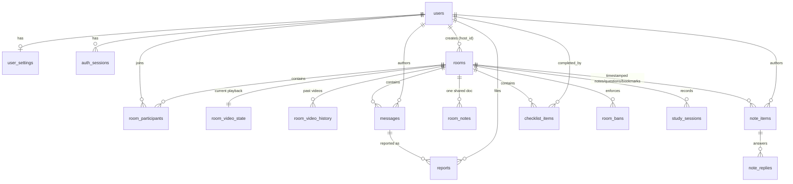

# SyncStudy — Engineering Plan & Build Blueprint

> **Status:** v1.1 blueprint · **Date:** 2026-08-23
>
> **Amendment A1 (v1.1) — accounts are website-only.** Email addresses, email verification, password-reset mail, and Google OAuth are removed from the design. An account is a **username + display name + password**, created on the site. A one-time **recovery code** replaces the reset-by-email flow. Consequences: no `email`/`oauth_accounts`/`verification_tokens` in the schema, no transactional-email provider in the stack or the cost model, and auth is a ~250-line first-party module instead of an auth library. See §3.1, §4.2, §7.2, §10.1, §11.1, §11.9, §14 Phase 2.
> **Amendment A2 (v1.1) — chat's read-after-write hazard is part of the contract.** Building Phase 5 turned §6.5's write-behind rule from a performance note into something every *reader* of `messages` has to know about: a message is broadcast before it is in Postgres, so anything that reads it back within a few hundred milliseconds — a delete, a report, a join snapshot — must account for the queue. Two shipped features were broken by this and both passed their tests, because the tests slept first. Consequences: `room:join` gained an optional `lastMessageId` backfill cursor (§10.2), three chat keys were added to the Redis layout (§7.3), and the rule itself is written down as [ADR 0006](./docs/ADR/0006-chat-is-broadcast-first.md). See also [ADR 0007](./docs/ADR/0007-order-messages-by-id.md) on why the transcript is ordered by `id` and never by `created_at`.
> **Amendment A3 (v1.2) — Phases 6-10 are built; four contract changes came with them.**
> 1. **Two Redis keys for the live notes tier** (§7.3): `room:{id}:notes` (HASH, 6h — the block document) and `room:{id}:notelock:{blockId}` (STRING, 8s — the §8.12 soft lock). Same two-tier rule as everything else: a document being typed into cannot round-trip Postgres per keystroke, and losing Redis costs at most one debounce window because `room_notes.content` is re-split into blocks on the next cold read.
> 2. **`NotesDocView` carries `blocks`** (§10.2). The client cannot mint block ids: an update for an id the server has never seen is a *new* block, so a client that invented them would duplicate the whole document on its first edit. `notes:block_updated` gained `position` for the same reason — a client that had to guess where a new paragraph goes would put a conflict-preserved copy at the end instead of below its winner.
> 3. **A conflict does not write a marker into the user's text.** §8.12 said "appending it as a new block below with a marker". The loser's text is preserved verbatim as a new block below the winner, and the *loser* is told (the ack carries `winning`); the marker is UI, not content. Putting it in the text would corrupt the document and the §3.6 S7 export.
> 4. **The shortcut sheet is `Ctrl`/`Cmd`+`/`, not `?`.** §12.5's own key table binds `?` to "new question at current timestamp" and its prose asks for "a `?`-triggered shortcut sheet". They are the same keystroke. `?` keeps the question — it is §2.5's retention feature — and the sheet also has an entry in the room menu.
>
> **Amendment A4 (v1.3) — ephemeral shared ink.** Participants can draw over the video; everyone sees the stroke live and it fades out a few seconds later. It is a shared laser pointer for "look at *this* term here", not a whiteboard, and it is the first feature in the product with **no durable write at all** — no table, no Redis key, no snapshot field, no replay for late joiners. That is what lets it be the highest-frequency event family in the app (~20 messages/second per drawing user) and why it needs no moderation queue: nothing drawn can outlive the conversation it belonged to. Contract changes: eight `INK_*` constants and `DrawStroke`/`DrawClear` (§10.2), the `annotate` permission (§11.2), `rooms.annotations_enabled` so a host can switch it off (§7.2), and a new §3.6 S10. The one subtlety worth reading before touching it is in [ADR 0008](./docs/ADR/0008-ink-is-ephemeral.md): coordinates are 0..1 against the **picture**, not the stage box, because the box is not reliably 16:9 and normalising against it silently puts the same stroke on a different part of the lecture for anyone whose window is a different shape.
>
> **Amendment A4 (v1.2) — `uuidv7` is monotonic within a millisecond.** ADR 0007 orders the transcript by `id` and nothing else, on the grounds that "id order is time order". That was only true at millisecond granularity: the original implementation drew fresh randomness on every call, so two ids minted in the same millisecond sorted arbitrarily against each other. Stably, on every client — but not in send order, which is a real defect for a burst, a retry, or two sends from one node. `uuidv7()` now increments the entropy while the millisecond is unchanged (RFC 9562 §6.2), and `uuidv7At()` is the pure form for tests. Found by an integration test, not by review.
>
> **Audience:** the engineer (human or AI coding agent) who will build this.
> **Rule for the builder:** this document is the source of truth. Where it makes a decision, follow it. Where it says *"defer"*, do not build it yet. Where you disagree, change this document first, then the code.

---

## 0. How to use this document

This is not a pitch deck. It is a build spec. It is ordered so that you can implement it top-to-bottom:

| If you are… | Read |
|---|---|
| Setting up the repo on day one | §4, §20, §14 Phase 1 |
| Building auth | §7, §11.1–11.3, §14 Phase 2 |
| Building rooms | §7, §10, §14 Phase 3 |
| Building the hard part (video sync) | **§8 in full** — this is the core IP of the product |
| Building chat | §3.5, §6.5, §11.6, §14 Phase 5 — and Amendment A2 before you touch a read path |
| Building calls | **§9 in full** |
| Making it not look like AI slop | **§12** — has literal hex values and timing curves |
| Deciding what to cut | §13 |

**Non-goals for v1 (do not build these):** organizations/teams, billing, an LMS, AI tutoring features, recording sessions to video, a mobile native app, SSO/SAML, an admin analytics dashboard, i18n. Every one of these is a trap that will cost you the launch.

---

## 1. Product overview

### 1.1 What it is

SyncStudy is a web app where a student creates a **private study room**, shares a code, and 2–6 friends join. Everyone watches the same lecture video in **frame-accurate-ish sync** (target: <500ms spread across participants), talks over **voice chat**, and takes **shared notes pinned to video timestamps**.

### 1.2 The one-sentence product thesis

*Watching a 3-hour lecture alone is miserable; watching it with your group in a Discord call requires four apps and manual "ok, pause, 3-2-1" — SyncStudy is one tab that does all of it.*

### 1.3 Who it is for

Primary: **university and senior-high students, 16–24, studying from YouTube lecture content** (Organic Chemistry Tutor, 3Blue1Brown, Khan, MIT OCW, exam-prep channels). They study in groups of 2–6. They are on mid-range laptops and Chromebooks, on residential/dorm Wi-Fi, and half of them are on mobile at some point.

Secondary: study-abroad / remote-cohort students in different timezones who already coordinate over WhatsApp.

### 1.4 Design constraints that shape every decision below

1. **Group size is 2–6, almost always.** This single fact means WebRTC mesh is sufficient for the overwhelming majority of sessions and lets us run calls at **$0 marginal media cost**. Do not build an SFU first.
2. **Students have no money.** The architecture must be runnable for **<$30/month at launch** and must not require a rewrite to reach 10k concurrent users.
3. **Sessions are long.** A study session is 45–180 minutes. This punishes memory leaks, connection churn, and slow drift far more than a typical chat app. Long-lived correctness > flashy features.
4. **Student data is sensitive.** Some users will be under 18. Default to private, minimal PII, no public discovery, no behavioural ads. See §11.9.
5. **The UI must look like a tool, not a demo.** See §12.

### 1.5 Success criteria for v1

| Metric | Target |
|---|---|
| Playback spread between any 2 participants | p50 < 250 ms, p95 < 600 ms |
| Hard-seek corrections per participant per hour | < 4 |
| Room join → video playing in sync | < 3 s |
| Voice call setup (peer connected) | < 2 s p95 |
| Session crash / forced-reload rate | < 1 per 100 room-hours |
| Infra cost at 100 concurrent users | < $40 / month |

---

## 2. User flows

Flows are written as state transitions so they can be turned directly into tests (§15).

### 2.1 First-time user → studying (the critical path)

```
Landing (/)
  └─ "Create a study room"
       ├─ [not authed] → /signup ──► username + display name + password
       │                              ├─ create user, hash pw (argon2id)
       │                              ├─ set session cookie
       │                              └─ redirect back to intent (?next=/rooms/new)
       └─ [authed] ────────────────► POST /api/rooms
                                      ├─ server generates 8-char code (Crockford b32)
                                      ├─ creator becomes host
                                      └─ redirect /r/{code}
Room shell loads
  ├─ WS connect + auth handshake
  ├─ clock sync burst (8 pings, ~400ms)
  ├─ room:snapshot received → render participants/chat/notes
  ├─ no video set → host sees "Paste a YouTube link" empty state
  └─ host pastes link → video:set → all clients load player (paused, t=0)
Host clicks Play
  ├─ optimistic local play
  ├─ video:control{action:play} → server → video:state broadcast
  └─ all clients converge (§8)
Host clicks "Join voice"
  ├─ getUserMedia(audio) → permission prompt
  ├─ rtc:join → server returns ICE config (short-lived TURN creds)
  └─ mesh offers/answers with each existing caller
```

**Time budget for this whole path: under 90 seconds for a new user.** If it takes longer in testing, cut steps, not polish.

### 2.2 Invited participant joins

```
Receives link https://syncstudy.app/r/K3M7-QP2X (or types code on /join)
  ├─ [not authed] → /login?next=/r/K3M7-QP2X
  │     └─ (allow "continue as guest" ONLY if room.allow_guests = true; guest gets
  │        an ephemeral account, display name required, cannot create rooms)
  ├─ GET /api/rooms/K3M7QP2X/preview  → { title, hostName, participantCount, requiresPasscode, isFull }
  ├─ [banned] → 403 "You can't join this room"
  ├─ [full]   → 409 "Room is full (12/12)"
  ├─ [passcode] → prompt → POST /api/rooms/:code/join {passcode}
  └─ joins → WS connect → room:snapshot (includes authoritative video anchor)
        └─ Autoplay gate: browser will block audible autoplay. Show a single
           full-bleed "Join playback" button over the player. One click:
           player.playVideo() + unmute + apply snapshot. (§8.7)
```

### 2.3 Someone's Wi-Fi drops for 20 seconds

```
t=0    socket close (transport error)
t=0    client: UI shows a thin amber bar "Reconnecting…" (NOT a modal, NOT a spinner overlay)
       client: player keeps playing locally (do not pause — they may recover mid-sentence)
       client: discards any queued outbound control intents (stale)
t=0    server: marks participant status='reconnecting', starts 45s grace timer,
       broadcasts presence:update. Others see the avatar at 40% opacity. NOT removed.
t=2..20 socket.io reconnect with backoff (500ms → 1s → 2s → 4s, jitter, cap 10s)
t=20   reconnect → auth handshake → room:resync
       ├─ server cancels grace timer, status='connected'
       ├─ sends snapshot + 3-sample clock re-sync
       └─ client computes drift (likely 1–3s if the room seeked) → hard seek → resume
t=45   (if never reconnected) server removes participant, broadcasts presence:leave
t=60   the HOST gets a longer window than everyone else (HOST_DISCONNECT_GRACE_MS),
       because removing them also hands the room to someone else — a costlier,
       noisier event than a member briefly vanishing. When that window expires the
       host is removed AND the room is handed over in the same step (§2.4).
```

**One timer, not two.** Host transfer happens *at* removal, never on a separate
later timer. A transfer scheduled after removal leaves `rooms.host_id` pointing at
someone who is no longer present, so for that window nobody can kick, mute, or
change room settings — and if the removal path also cancels the transfer timer (the
obvious implementation), the room is left permanently hostless.

### 2.4 Host leaves mid-session

```
Host clicks "Leave room"
  ├─ Dialog: "You're the host. Choose who takes over:" [list] [Just leave] [Cancel]
  ├─ If "just leave" → server promotes longest-connected non-guest participant
  └─ Broadcast room:host_changed → new host's UI grows host controls in place
     (no page reload, no toast storm — one line in chat: "Priya is now the host")
Room continues. Room only ends when the last participant leaves (§8.11).
```

### 2.5 Timestamped question flow (the retention feature)

```
While watching at 41:12, a student is confused.
  ├─ Presses "?" hotkey (or clicks the ? button under the player)
  ├─ Player pauses LOCALLY ONLY (does NOT pause the room) — optional toggle
  ├─ Composer opens pre-filled "@41:12 — "
  ├─ Submits → note:create{kind:'question', video_ts: 2472}
  ├─ Appears in the Notes tab AND as a small tick mark on the video scrubber
  └─ Anyone can click the tick → seeks the ROOM to 41:12 (permission-checked)
     and marks the question resolved when answered.
```

---

## 3. Feature specification

Legend: **[M]** = MVP (§13) · **[2]** = post-MVP v1.1 · **[3]** = later / defer

### 3.1 Accounts

| # | Feature | Tier | Spec |
|---|---|---|---|
| A1 | Username + password signup | M | **No email, no third-party sign-in.** Account = username + display name + password. Nothing to verify, nothing to send. Password ≥10 chars, checked against a 10k-common-password list (not full HIBP — keep it local). argon2id. |
| A2 | Recovery code | M | Because there is no email, a forgotten password is otherwise unrecoverable. At signup we generate one 24-char recovery code, store only its argon2id hash, and surface it in a dismissible banner + `/settings/account`. Redeeming it sets a new password and invalidates every session. |
| A3 | Session management | M | Server-side sessions in Postgres, httpOnly cookie, 30-day sliding expiry, "sign out everywhere". |
| A4 | Profile: display name, handle, avatar, bio(140), school(free text) | M | Handle is unique, `[a-z0-9_]{3,20}`. School is **free text and optional** — no institution database. |
| A5 | Avatar upload | M | ≤5MB, jpeg/png/webp only (magic-byte checked), resized server-side to 256px + 64px webp, EXIF stripped, stored in R2. Default = deterministic geometric avatar generated from user id (no external gravatar call — privacy). |
| A6 | Privacy settings | M | `profile_visibility: public\|rooms_only\|private`, `allow_dm_invites: bool`, `show_online_status: bool`, `default_room_privacy: private` (locked to private for under-18 accounts). |
| A7 | Guest access | 2 | Per-room opt-in. Ephemeral user row, `is_guest=true`, expires 24h, cannot host, cannot create, name-badged "Guest" in the participant list. |
| A8 | Account deletion | M | Hard-deletes PII, anonymizes messages to "Deleted user" rather than cascading (keeps room history readable). 7-day soft-delete window. |
| A9 | Password change / recovery | M | Change: requires the current password. Recover: requires the recovery code. Both invalidate all sessions and issue a fresh recovery code. |

### 3.2 Study rooms

| # | Feature | Tier | Spec |
|---|---|---|---|
| R1 | Create room | M | Fields: name (required, ≤60), privacy (default **private**), max participants (default 8, cap 12 for mesh / 25 with SFU), playback control policy (default `everyone`). |
| R2 | Room code + link | M | 8 chars from Crockford base32 with **both** members of every confusable pair removed (no 0/O, no 1/I/L, no U) → alphabet `23456789ABCDEFGHJKMNPQRSTVWXYZ` (30 chars, 30^8 ≈ 6.6×10^11). Removing both members means a code can never contain a misreadable character, so there is no repair step that could silently resolve to the wrong room. Displayed as `K3M7-QP2X`. Case-insensitive, normalized on lookup. |
| R3 | Optional passcode | 2 | 4–32 chars, hashed (argon2id), rate-limited at 5 attempts / 10 min / IP+code. |
| R4 | Private by default | M | `unlisted` (link/code only) is the default and only v1 mode. There is **no public room directory in v1** — it is a moderation liability with no user demand yet. |
| R5 | Host & co-hosts | M | Exactly one host. Host may grant `co_host` to others. Roles: `host` > `co_host` > `member` > `guest`. |
| R6 | Participant list | M | Live presence: connected / reconnecting / in-call / muted / camera-on / speaking / screen-sharing. Sorted: you, host, co-hosts, then join order. |
| R7 | Host controls | M | Kick, ban, mute-for-everyone (asks the target's client to mute; a client can unmute again unless `force_mute` is set), transfer host, lock playback control, lock chat, set max participants, end room for all. |
| R8 | Leave / rejoin | M | Leaving keeps your `room_participants` row with `left_at` set; rejoin flips it back and restores your note/checklist authorship. |
| R9 | Room persistence | M | Live state in Redis; snapshotted to Postgres every 15s and on last-leave. Rooms are resumable for **14 days** of inactivity, then archived (chat + notes readable, room not joinable). |
| R10 | Room list / "My rooms" | M | Recent rooms you've joined, with last-active and current occupancy. |
| R11 | Scheduled rooms | 3 | Defer. Calendar invites are a rabbit hole. |

### 3.3 Synchronized video

Full design in **§8**. Feature-level surface:

| # | Feature | Tier |
|---|---|---|
| V1 | YouTube embed via IFrame Player API | M |
| V2 | Play / pause / seek sync | M |
| V3 | Authoritative server timeline + drift auto-correction | M |
| V4 | Late-join sync | M |
| V5 | Reconnect resync | M |
| V6 | Playback-control permission policy (`everyone` / `host_and_cohosts` / `host_only`) | M |
| V7 | Conflict resolution (revision + control-lock) | M |
| V8 | Playback rate sync (0.75×–2×) | 2 |
| V9 | "Wait for slow connections" mode | 2 |
| V10 | Room playlist / queue of videos | 2 |
| V11 | Direct MP4/HLS URL support | 3 |
| V12 | Uploaded video files | 3 — bandwidth + copyright liability. Do not build. |

### 3.4 Participant calls

Full design in **§9**.

| # | Feature | Tier |
|---|---|---|
| C1 | Voice call, WebRTC mesh, ≤8 in call | M |
| C2 | Mute/unmute, push-to-talk (hold Space when not typing) | M |
| C3 | Speaking indicator (local VAD, throttled broadcast) | M |
| C4 | Join/leave call independently of the room | M |
| C5 | Automatic audio ducking of the video when someone speaks | M — **underrated killer feature**: drop video volume to 35% over 180ms while any peer is speaking, restore after 600ms of silence. |
| C6 | Camera on/off, video mesh ≤4 | 2 |
| C7 | Screen share (1 at a time, server-enforced lock) | 2 |
| C8 | Device picker (mic/camera/output) + level meter | 2 |
| C9 | Host: mute-all, force-mute a participant, disable cameras | 2 |
| C10 | SFU path for 7+ video participants | 3 (design it in now, ship later — §9.6) |
| C11 | Noise suppression | M via browser constraints (`noiseSuppression: true`, `echoCancellation: true`, `autoGainControl: true`). No RNNoise/WASM in v1. |

### 3.5 Chat

| # | Feature | Tier |
|---|---|---|
| H1 | Real-time room chat, 2000-char limit | M |
| H2 | Avatar + display name + relative timestamp (hover = absolute) | M |
| H3 | Persisted history (last 500 messages loaded, infinite scroll back) | M |
| H4 | Optimistic send with `client_msg_id` dedupe + failed-send retry | M |
| H5 | Link handling: auto-detect, render as text with a safe `<a>` (rel="noopener noreferrer nofollow", target=_blank), **no unfurls/previews in v1** (SSRF + phishing surface) | M |
| H6 | `@41:12` timestamps auto-linkify → click seeks the room | M — cheap, delightful, on-brand |
| H7 | Replies (single-level quote) | 2 |
| H8 | Emoji reactions | 2 |
| H9 | Typing indicator (throttled, 3s TTL) | 2 |
| H10 | Moderation: delete own message; host deletes any; report to platform | M |
| H11 | Slow mode (host: 1 msg / N sec) | 2 |
| H12 | File/image upload in chat | 3 — CSAM/abuse liability with student users. Do not build without a moderation vendor. |

### 3.6 Collaborative study tools

| # | Feature | Tier | Spec |
|---|---|---|---|
| S1 | Shared notes (one doc per room) | M | v1: plain-text/markdown textarea, **debounced last-write-wins with field-level authorship** (see §8.12 — a genuinely simple approach that doesn't lose data in practice for 2–6 users). |
| S2 | Yjs CRDT upgrade for notes | 2 | Same UI, real concurrent editing, cursors. |
| S3 | Timestamped notes / questions / bookmarks | M | One table, `kind: note\|question\|bookmark`, each optionally pinned to `video_ts`. Rendered as ticks on the scrubber. |
| S4 | Click a timestamp → seek the room | M | Permission-checked like any seek. |
| S5 | Question resolve/unresolve + answer thread | 2 | |
| S6 | Shared checklist | M | Ordered items, per-item `completed_by` + `completed_at`, drag to reorder (host/co-host), anyone can check. |
| S7 | Export session (markdown: notes + questions + checklist + timestamps) | 2 | High perceived value, ~4 hours of work. Do it early in v1.1. |
| S8 | Pomodoro timer synced to the room | 2 | Server-anchored the same way video is — reuse §8's anchor pattern exactly. |
| S9 | Flashcards / quizzes / AI summaries | 3 | Scope creep. No. |
| S10 | Ephemeral shared ink over the video | **built** | Draw with a pointer or finger; everyone sees it live and each stroke fades after `INK_HOLD_MS + INK_FADE_MS`. Never persisted (ADR 0008). Coordinates are 0..1 on the picture. Host can disable per room; guests cannot draw. |

---
## 4. Technical architecture

### 4.1 The shape of the system

The single most important architectural fact: **SyncStudy needs a long-lived, stateful process that holds WebSocket connections and per-room in-memory state.** Serverless functions cannot do this. Therefore the app is split into two deployables plus managed data stores.

```
                          ┌──────────────────────────────┐
                          │  Browser (Next.js SPA shell) │
                          │  ─ React UI                  │
                          │  ─ YT IFrame Player          │
                          │  ─ socket.io-client          │
                          │  ─ RTCPeerConnection × N     │
                          └───┬──────────┬───────────┬───┘
                  HTTPS (REST)│          │ WSS       │ SRTP/DTLS (media, P2P)
                              │          │           │
              ┌───────────────▼──┐   ┌───▼─────────┐ │
              │  web  (Vercel)   │   │  realtime   │ │
              │  Next.js 15      │   │  Fastify +  │ │
              │  ─ SSR pages     │   │  Socket.IO  │ │
              │  ─ /api/* REST   │   │  (Fly.io,   │ │
              │  ─ auth routes   │   │   2+ nodes) │ │
              └────┬─────────────┘   └──┬───────┬──┘ │
                   │                    │       │    │
                   │  ┌─────────────────▼──┐ ┌──▼────▼──────────┐
                   ├─►│ PostgreSQL (Neon)  │ │ Redis (Upstash)  │
                   │  │ durable truth      │ │ ephemeral truth  │
                   │  └────────────────────┘ │ ─ room state     │
                   │                         │ ─ presence       │
                   │  ┌────────────────────┐ │ ─ pub/sub fanout │
                   └─►│ Cloudflare R2      │ │ ─ rate limits    │
                      │ avatars            │ └──────────────────┘
                      └────────────────────┘
                                              ┌──────────────────┐
                      media relay fallback ──►│ coturn (TURN)    │
                      (~10-15% of peers)      │ Hetzner CX22     │
                                              └──────────────────┘
```

### 4.2 Technology decisions, with reasoning and alternatives

Every row is a decision, not a suggestion.

| Layer | Choice | Why this | Alternatives considered | Why not |
|---|---|---|---|---|
| **Frontend framework** | **Next.js 15 (App Router) + React 19 + TypeScript (strict)** | Room page is a heavy client app, but landing/auth/dashboard benefit from SSR + file routing + image optimisation. One framework for both. Huge ecosystem, best AI-agent familiarity. | Vite + React Router SPA | Loses SSR for marketing/SEO, and you'd hand-roll routing/meta. Fine choice, marginally simpler; Next wins on the marketing surface. |
| | | | SvelteKit / Nuxt | Smaller ecosystem for the WebRTC/YT-player glue; more novel code for an agent to get wrong. |
| **Styling** | **Tailwind CSS v4 + CSS variables for tokens** | Tokens in CSS vars (§12.3) make theming trivial and keep the design honest. Tailwind avoids a naming layer. | CSS Modules / vanilla-extract | More files, slower iteration. |
| | | | Any component library with a strong opinion (MUI, Chakra, Ant) | They impose a look. §12 requires a specific restrained look; fighting a library is worse than composing primitives. |
| **UI primitives** | **shadcn/ui (Radix under the hood), copied into repo** | Accessible dialogs/popovers/tooltips/dropdowns you own and can restyle to §12 exactly. No runtime dep, no vendor look. | Headless UI | Fewer primitives (no proper dropdown menu / context menu). |
| **Client state** | **Zustand** for room session state; **TanStack Query** for REST resources | Room state is a single high-frequency store touched by socket events — Zustand's transient updates (`subscribeWithSelector`) avoid re-rendering the player 10×/sec. Query handles caching/invalidation for profiles, room lists, message history. | Redux Toolkit | Boilerplate not justified at this size. |
| | | | React Context alone | Context re-renders the whole subtree; fatal with a 1 Hz drift loop and audio-level events. |
| **Backend (REST/auth)** | **Next.js Route Handlers** (`/app/api/*`) | Auth, profiles, room CRUD, uploads are ordinary request/response. Colocating them removes a whole service. | Separate Fastify API | Adds CORS, a second deploy, and duplicate auth code for no benefit at this scale. |
| **Backend (realtime)** | **Node 22 + Fastify + Socket.IO 4, standalone container** | Must be stateful and long-lived. Fastify for its health/metrics/HTTP side; Socket.IO for rooms, acks, reconnection, and the Redis adapter. | Raw `ws` + custom protocol | You would rebuild heartbeats, reconnection with backoff, ack/response correlation, and room fan-out. That's 2 weeks and a class of bugs. Socket.IO's ack callbacks are *directly used* by the clock-sync algorithm (§8.3). |
| | | | Cloudflare Durable Objects / PartyKit | **Genuinely excellent fit** — one DO per room is exactly the right consistency model, and it's cheap. Rejected for v1 only because: WebRTC TURN/coturn integration, coturn-style long-lived ops, and local dev/debugging are all more awkward, and the Node ecosystem for `socket.io` + `ioredis` + Prisma is far better trodden for an AI agent. **Keep the room logic isolated behind a `RoomStore` interface (§6.4) so migrating to DOs later is a 2-day job, not a rewrite.** |
| | | | Elixir/Phoenix Channels | Best-in-class for this problem, genuinely. Rejected: team/agent familiarity, and Node keeps one language across the stack. |
| | | | Managed realtime (Pusher / Ably / Liveblocks) | Per-connection pricing kills the cost target (§18) and you cannot run server-authoritative timeline logic inside them. |
| **Database** | **PostgreSQL 16 (Neon serverless)** | Relational data with real foreign keys (users↔rooms↔participants↔messages). Neon: scale-to-zero, branching for preview envs, generous free tier. | MongoDB | The data is relational. You would hand-roll joins and lose referential integrity on cascade deletes. |
| | | | Supabase | Good option; bundles auth + storage + realtime. Rejected because its realtime layer can't host our authoritative sync loop, so we'd run a Node service anyway — and then Supabase's main advantage evaporates while adding lock-in. |
| | | | SQLite/Turso | Tempting cheapness, but multi-region write latency + weaker connection story for a stateful socket fleet. |
| **ORM** | **Prisma 6** | Type-safe queries, migrations, and it is by far the best-documented ORM for an AI agent to write correct code against. | Drizzle | Leaner, faster cold starts, closer to SQL. Legitimate alternative — pick it if you want raw-SQL control. Prisma chosen for migration ergonomics + agent reliability. |
| **Ephemeral store / pub-sub** | **Redis 7 (Upstash serverless, or Fly Redis)** | Holds authoritative live room state, presence, cross-node pub/sub via `@socket.io/redis-adapter`, and token-bucket rate limits. | In-process memory only | Works for exactly one node. Breaks the moment you add a second, and you will. |
| | | | Postgres LISTEN/NOTIFY | Payload size limits, no TTL, adds DB load on the hot path. |
| **Auth** | **First-party session auth** — argon2id + opaque session tokens in Postgres, httpOnly cookie (~250 lines in `packages/auth`) | With no email verification, no password-reset mail, and no OAuth callbacks, an auth library earns nothing here: what's left is hash-a-password, issue-a-token, look-it-up. Owning it means `getSessionFromCookieHeader()` is a plain function the **Socket.IO handshake** can call directly (§11.4) with no framework request context, and there is zero per-MAU cost. | Better Auth / Auth.js | Both are good, and both are shaped around the email + OAuth flows we removed. Adopting one now would mean configuring away most of it. |
| | | | Auth.js (NextAuth) | Viable. Better Auth chosen for a cleaner server-side session API outside of Next's request context (needed by the socket server) and first-class TypeScript. |
| | | | Clerk / Auth0 / WorkOS | Per-MAU pricing, and validating their session from a raw WebSocket handshake is friction. |
| **Realtime transport** | **Socket.IO over WSS**, `transports: ['websocket']` (skip long-polling upgrade; set `upgrade:false` after first connect attempt) | See above. Polling fallback is retained only as an explicit degraded mode for locked-down campus networks. | SSE + POST | Half-duplex; adds latency to control events, which directly worsens sync. |
| **WebRTC (v1)** | **Full-mesh P2P**, audio ≤8, video ≤4 | Zero media server cost, lowest latency, no bandwidth bills. Matches the 2–6 group reality. | SFU from day one | Costs money and weeks, for a case that ~5% of sessions hit. |
| **WebRTC (v1.2)** | **LiveKit, self-hosted single node** when call size >4 video / >8 audio | Open source, mature simulcast + dynacast, Node server SDK, and self-hosting on one Hetzner box costs ~€8/mo with 20 TB egress included. Migrate later without changing the client's *room* logic. | mediasoup | More control, much more code (you write the routing/simulcast policy yourself). |
| | | | LiveKit Cloud / Daily / Agora | Per-minute pricing. Use LiveKit Cloud's free tier for development, self-host for production. |
| | | | Jitsi (JVB) | Heavier ops, Java, less pleasant SDK story. |
| **STUN** | Google `stun:stun.l.google.com:19302` **plus** our own coturn as STUN | Free, but never depend on a single third-party STUN. Always list ours too. | — | — |
| **TURN** | **coturn** on a Hetzner CX22 (2 vCPU / 4 GB / 20 TB traffic, ~€4.5/mo), with **Cloudflare Calls TURN as a documented failover** ($0.05/GB, 1 TB/mo free) | ~10–15% of peer pairs need relay (symmetric NAT, corporate/campus firewalls). Self-hosted flat-rate is dramatically cheaper than metered at any real volume. Short-lived HMAC credentials (§9.3). | Twilio NTS / Metered / Xirsys | $0.40–$0.60/GB. A single 90-min relayed video call ≈ 0.5 GB per direction. Bill explodes. |
| **Video source** | **YouTube IFrame Player API** | Where the educational content actually is. Zero storage/CDN cost. | Self-hosted video (Mux/Cloudflare Stream/S3+HLS) | Storage + egress + encoding costs, plus you'd need users to *have* the files. Copyright liability. |
| **Object storage** | **Cloudflare R2** | **Zero egress fees** — avatars are read constantly. S3-compatible API. 10 GB free. | AWS S3 + CloudFront | Egress cost, more config. |
| **Hosting: web** | **Vercel** | Zero-config Next.js, preview deploys per PR, free tier covers launch. | Fly.io / Railway (Docker) | Fine; use if you want everything in one place. |
| **Hosting: realtime** | **Fly.io** (2× `shared-cpu-1x` 512 MB to start, in one region near your users) | Real long-lived TCP, WebSocket-native, cheap, multi-region later, `fly scale count 3` when needed. | Railway | Also good, slightly simpler. |
| | | | Render / Heroku | More expensive per-connection. |
| | | | AWS ECS/Fargate + ALB | Correct at 10k+ users; overkill and slow to iterate at launch. Migration path is just a Dockerfile. |
| **Monitoring** | **Sentry** (frontend + backend errors, session replay off by default for privacy), **Axiom** or **Better Stack** (structured logs), **Grafana Cloud free tier** scraping `/metrics` (prom-client) from the realtime service, **UptimeRobot** for uptime | We need custom realtime metrics (§16.5) far more than APM traces. | Datadog | Cost. |
| **CI/CD** | GitHub Actions: typecheck → lint → unit → integration (Postgres+Redis services) → build → deploy | | | |
| **Package manager / repo** | **pnpm workspaces monorepo** | `packages/shared` holds the event contract + Zod schemas used by *both* web and realtime. This single decision prevents the #1 realtime bug class: client and server disagreeing about a payload shape. | Two repos | Contract drift. Don't. |

### 4.3 Repository layout

```
syncstudy/
├─ apps/
│  ├─ web/                        # Next.js 15
│  │  ├─ app/
│  │  │  ├─ (marketing)/page.tsx          # landing
│  │  │  ├─ (auth)/login|signup|reset/
│  │  │  ├─ (app)/dashboard/page.tsx      # my rooms
│  │  │  ├─ (app)/settings/…
│  │  │  ├─ r/[code]/page.tsx             # ROOM (client-heavy)
│  │  │  ├─ join/page.tsx
│  │  │  └─ api/…                         # REST route handlers
│  │  ├─ components/
│  │  │  ├─ ui/                           # shadcn primitives, restyled
│  │  │  └─ room/                         # Player, Sidebar, Chat, Notes, CallBar…
│  │  ├─ lib/
│  │  │  ├─ socket/                       # client, typed emitter, reconnect
│  │  │  ├─ sync/                         # clock.ts, controller.ts, players/
│  │  │  ├─ rtc/                          # mesh.ts, devices.ts, vad.ts
│  │  │  └─ stores/                       # zustand slices
│  │  └─ …
│  └─ realtime/                   # Fastify + Socket.IO
│     ├─ src/
│     │  ├─ index.ts
│     │  ├─ auth/handshake.ts
│     │  ├─ rooms/RoomStore.ts            # interface + Redis impl
│     │  ├─ rooms/videoState.ts           # THE authoritative timeline
│     │  ├─ handlers/{room,video,chat,notes,rtc,presence}.ts
│     │  ├─ ratelimit/tokenBucket.ts
│     │  ├─ persistence/snapshotter.ts
│     │  └─ metrics.ts
│     └─ …
├─ packages/
│  ├─ shared/                     # ⚠ the contract: event names, Zod schemas, TS types
│  ├─ db/                         # Prisma schema + client + migrations + seed
│  └─ config/                     # eslint, tsconfig, tailwind preset
├─ infra/
│  ├─ coturn/turnserver.conf
│  ├─ fly.realtime.toml
│  └─ docker-compose.dev.yml      # postgres + redis + coturn for local dev
└─ docs/  (this plan + ADRs)
```

---

## 5. Frontend architecture

### 5.1 Rendering strategy

| Route | Strategy | Reason |
|---|---|---|
| `/`, `/about`, `/privacy` | Static (SSG) | SEO, instant |
| `/login`, `/signup` | Server component shell + client form | |
| `/dashboard` | Server component, fetches rooms with the session cookie | No loading spinner on the most-visited page |
| `/r/[code]` | **Server component does auth + membership check + returns a minimal `RoomBootstrap` prop, then renders a `'use client'` `<RoomShell>`** | Prevents the flash-of-unauthorized and gets the room title into the document title server-side. Everything after mount is socket-driven. |

`/r/[code]` must **not** fetch chat/notes/participants server-side. Those arrive in `room:snapshot` over the socket ~200 ms after mount; fetching them twice causes a visible content swap.

### 5.2 The room client: module boundaries

```
RoomShell (client)
├─ SocketProvider          ── owns the socket.io client, auth, reconnect, and
│                             a typed emit()/on() wrapper from packages/shared
├─ useRoomStore (zustand)  ── slices: room, participants, video, chat, notes,
│                             checklist, call, connection
├─ SyncController          ── headless. Owns clock.ts + drift loop + the
│                             PlayerAdapter. NEVER renders. (§8)
├─ MeshController          ── headless. Owns RTCPeerConnections + VAD. (§9)
└─ UI tree                 ── §12.4
```

**Rule: the sync loop and the mesh loop must be headless controllers, not React components.** They run on timers, mutate a store with transient (non-reactive) writes for high-frequency values (current time, audio levels), and publish only *coarse* reactive state (isPlaying, drift severity, peer connection state). Violating this is how you get a UI that re-renders 10 times a second and a video player that stutters on low-end laptops.

### 5.3 The PlayerAdapter abstraction

Do **not** couple the sync engine to YouTube. Define one interface; ship one implementation now, add HTML5 later.

```ts
// packages/shared/src/player.ts
export interface PlayerAdapter {
  load(videoId: string, startAtSec: number, autoplay: boolean): Promise<void>;
  play(): Promise<void>;
  pause(): Promise<void>;
  seek(sec: number, allowSeekAhead?: boolean): Promise<void>;
  getPosition(): number;              // seconds, best-effort
  getDuration(): number;
  getState(): PlayerState;            // 'unstarted'|'ended'|'playing'|'paused'|'buffering'|'cued'
  setVolume(v0to1: number): void;
  getAvailableRates(): number[];
  setRate(r: number): void;
  /** Highest-resolution position source available; falls back to getPosition. */
  getPositionPrecise(): { position: number; measuredAtMs: number };
  on(evt: 'statechange'|'ready'|'error', cb: (p: unknown) => void): () => void;
  destroy(): void;
}
```

`YouTubePlayerAdapter` wraps the IFrame API. **Known YouTube quirks you must handle (do not skip these — each one is a real bug):**

1. `getCurrentTime()` updates at roughly 4 Hz, not per-frame. Never treat sub-250 ms drift as real. This sets our dead zone.
2. `getCurrentTime()` keeps returning the *pre-seek* value for 100–400 ms after `seekTo()`. Ignore drift measurements for 700 ms after any local seek (`suppressUntil`).
3. `playVideo()` on a page without a user gesture silently fails or plays muted. Handle with the autoplay gate (§8.7).
4. `getAvailablePlaybackRates()` frequently returns only `[0.25,0.5,0.75,1,1.25,1.5,1.75,2]`. There is **no 1.05×**, so the "gentle rate nudge" trick used by HTML5 players is unavailable on YouTube. Use micro-seeks instead (§8.6).
5. Some videos are embed-disabled. Detect via the `onError` codes `101`/`150` and show a clear "This video can't be played outside YouTube — try another link" state. Validate at paste time by probing the oEmbed endpoint server-side.
6. Ads can inject unpredictable delays for non-Premium users, appearing as a 5–30 s drift spike for one participant. Detect a `buffering`/`unstarted` transition lasting >3 s while the room is playing, mark that client `stalled`, and suppress its drift corrections until it returns to `playing`, then hard-seek once.
7. Never hide or overlay the YouTube player's own branding/controls in a way that violates the embed terms. Our custom control bar sits **below** the iframe and drives it via the API; we set `controls: 0` (permitted) but keep the YouTube logo and link intact.

### 5.4 Performance rules for the room page

- Player iframe is never unmounted on tab switches in the sidebar. Sidebar tabs are `hidden` via CSS, not conditionally rendered, so chat scroll position and notes cursor survive.
- Chat list is virtualized above 200 messages (`@tanstack/react-virtual`).
- Audio level meters update via `requestAnimationFrame` writing directly to a DOM ref's `style.transform` — **never** through React state.
- All socket handlers that touch high-frequency state use `useRoomStore.setState` outside of React batching, with selectors using `shallow` equality.
- Target: <60 React commits per minute on an idle room with an active call.

### 5.5 Responsive behaviour

| Breakpoint | Layout |
|---|---|
| ≥1280 px | Video left (flex-1), sidebar right (380 px fixed), control bar spans video column only |
| 1024–1279 px | Same, sidebar 320 px, sidebar can be collapsed to a 48 px icon rail |
| 768–1023 px (tablet) | Video full width on top, sidebar becomes a bottom sheet at 45% height with tabs |
| <768 px (mobile) | Video pinned top (16:9), tab bar under it (Chat / People / Notes), content fills remainder; control bar is a fixed bottom bar with 44 px touch targets; **camera defaults off, voice-only** |
| Mobile landscape | Video fills screen, sidebar becomes an overlay drawer |

Mobile caveats to design around, not discover later: iOS Safari requires a user gesture for `getUserMedia` *and* for audio playback; background tabs throttle timers to ≥1 Hz (breaks the drift loop — see §8.9); iOS may drop the WebRTC audio track when the app is backgrounded.

---

## 6. Backend architecture

### 6.1 Two services, clear split

| | `web` (Next.js) | `realtime` (Fastify + Socket.IO) |
|---|---|---|
| Owns | Auth, profiles, room CRUD, uploads, room preview/join validation, history pagination | Live room state, video timeline, presence, chat fan-out, notes sync, WebRTC signaling |
| State | Stateless | Stateful (Redis-backed, node-affine only for socket transport) |
| Scale | Vercel auto | `fly scale count N`, sticky sessions **not required** (we use `transports:['websocket']`, so no polling session affinity problem) |
| DB access | Prisma direct | Prisma (writes: messages, notes, snapshots) + Redis (hot path) |

### 6.2 Realtime server responsibilities, in order of importance

1. **Be the authoritative clock and timeline for every room.** (§8)
2. Authenticate every connection at handshake, authorize every event against room membership + role. (§11.4)
3. Fan out events to room members via the Redis adapter.
4. Rate-limit per socket, per event type. (§11.7)
5. Persist durable things asynchronously (messages, notes, snapshots) — **never block an event broadcast on a DB write**.
6. Emit metrics.

### 6.3 Room lifecycle in the realtime service

```
first socket joins room R
  ├─ RoomStore.acquire(R)          → Redis HSETNX room:R:state, TTL 6h
  ├─ load durable snapshot from Postgres if Redis is cold
  ├─ start room heartbeat timer (10s) — only ONE node runs it, held by a
  │  Redis lock `room:R:leader` (SET NX PX 15000, renewed every 5s)
  └─ start snapshotter (15s) — same leader
…
last socket leaves room R
  ├─ derive final position (§8.2), set status='paused'
  ├─ write snapshot to Postgres
  ├─ release leader lock
  └─ leave Redis state with a 6h TTL so a quick rejoin is instant
```

**Leader election matters.** With 2+ realtime nodes, room R may have participants on both. Only one node may run the periodic heartbeat/snapshot for R, or you get duplicate broadcasts and write races. A simple Redis `SET NX PX` lease with renewal is sufficient — do not reach for Raft.

### 6.4 The `RoomStore` interface (portability seam)

```ts
export interface RoomStore {
  getState(roomId: string): Promise<RoomLiveState | null>;
  /** Atomic read-modify-write. MUST be serialized per room. */
  transact<T>(roomId: string, fn: (s: RoomLiveState) => { next: RoomLiveState; result: T }): Promise<T>;
  addParticipant(roomId: string, p: PresenceEntry): Promise<void>;
  removeParticipant(roomId: string, userId: string): Promise<void>;
  listParticipants(roomId: string): Promise<PresenceEntry[]>;
  touch(roomId: string): Promise<void>;
}
```

The Redis implementation of `transact` uses a **Lua script** (`EVAL`) so the read-check-write of `{revision, status, anchor}` is atomic. This is the concurrency guarantee that makes §8.5's conflict resolution correct across multiple nodes. Do not implement it with `GET` then `SET`.

```lua
-- transact_video.lua  KEYS[1]=room:{id}:state
-- ARGV: expectedRevision, status, anchorPos, anchorServerMs, rate, actorId, nowMs, lockMs
local cur = redis.call('HMGET', KEYS[1], 'revision','lastChangeMs','lastActorId')
local rev = tonumber(cur[1]) or 0
local lastChange = tonumber(cur[2]) or 0
local lastActor = cur[3]
local expected = tonumber(ARGV[1])
if expected >= 0 and expected ~= rev then return {0, 'stale_revision', rev} end
-- control lock: another user changed it very recently
if lastActor and lastActor ~= ARGV[6]
   and (tonumber(ARGV[7]) - lastChange) < tonumber(ARGV[8]) then
  return {0, 'recently_changed', rev}
end
rev = rev + 1
redis.call('HSET', KEYS[1],
  'revision', rev, 'status', ARGV[2], 'anchorPos', ARGV[3],
  'anchorServerMs', ARGV[4], 'rate', ARGV[5], 'lastActorId', ARGV[6],
  'lastChangeMs', ARGV[7])
redis.call('PEXPIRE', KEYS[1], 21600000)
return {1, 'ok', rev}
```

### 6.5 Write-behind persistence

| Data | Path | Latency budget |
|---|---|---|
| Chat message | broadcast immediately with a server-assigned id+ts; enqueue INSERT | broadcast <10 ms; DB within 2 s |
| Note/checklist edit | broadcast immediately; debounce 800 ms then UPSERT | |
| Video state | Redis synchronously (it *is* the truth); Postgres snapshot every 15 s | |
| Presence | Redis only; never Postgres | |
| `room_participants.left_at` | Postgres on leave (low frequency) | |

Use a small in-process queue with bounded size and a flush interval (`p-queue` or hand-rolled). On overflow, drop presence-like data first, never chat.

---

## 7. Database schema

PostgreSQL 16. Shown as SQL DDL because that is unambiguous; translate to `schema.prisma` in `packages/db`. All ids are UUIDv7 (time-sortable — use `uuidv7()` from an extension or generate in app code) so index locality is good on the message table.

### 7.1 Entity relationships



### 7.2 DDL

```sql
-- ─────────────────────────── identity ───────────────────────────
CREATE TABLE users (
  id                UUID PRIMARY KEY,
  handle            CITEXT UNIQUE NOT NULL,     -- the username; [a-z0-9_]{3,20}
  password_hash     TEXT NOT NULL,
  recovery_hash     TEXT,                       -- argon2id of the one-time recovery code
  recovery_issued_at TIMESTAMPTZ,
  display_name      TEXT NOT NULL CHECK (char_length(display_name) BETWEEN 1 AND 40),
  avatar_key        TEXT,                       -- R2 object key; NULL => generated avatar
  bio               TEXT CHECK (char_length(bio) <= 140),
  school            TEXT CHECK (char_length(school) <= 80),
  is_guest          BOOLEAN NOT NULL DEFAULT FALSE,
  guest_expires_at  TIMESTAMPTZ,
  is_minor          BOOLEAN NOT NULL DEFAULT FALSE,  -- self-declared 13–17 at signup
  status            TEXT NOT NULL DEFAULT 'active'
                      CHECK (status IN ('active','suspended','deleted')),
  suspended_until   TIMESTAMPTZ,
  deleted_at        TIMESTAMPTZ,
  created_at        TIMESTAMPTZ NOT NULL DEFAULT now(),
  updated_at        TIMESTAMPTZ NOT NULL DEFAULT now()
);
CREATE INDEX users_guest_expiry_idx ON users (guest_expires_at) WHERE is_guest;

CREATE TABLE user_settings (
  user_id             UUID PRIMARY KEY REFERENCES users(id) ON DELETE CASCADE,
  profile_visibility  TEXT NOT NULL DEFAULT 'rooms_only'
                        CHECK (profile_visibility IN ('public','rooms_only','private')),
  show_online_status  BOOLEAN NOT NULL DEFAULT TRUE,
  allow_dm_invites    BOOLEAN NOT NULL DEFAULT FALSE,
  default_room_privacy TEXT NOT NULL DEFAULT 'private',
  theme               TEXT NOT NULL DEFAULT 'system' CHECK (theme IN ('system','light','dark')),
  -- device prefs, remembered across rooms
  default_mic_id      TEXT,
  default_camera_id   TEXT,
  default_speaker_id  TEXT,
  join_muted          BOOLEAN NOT NULL DEFAULT TRUE,   -- SAFE DEFAULT
  join_camera_off     BOOLEAN NOT NULL DEFAULT TRUE,   -- SAFE DEFAULT
  push_to_talk        BOOLEAN NOT NULL DEFAULT FALSE,
  reduce_motion       BOOLEAN NOT NULL DEFAULT FALSE,
  updated_at          TIMESTAMPTZ NOT NULL DEFAULT now()
);

CREATE TABLE auth_sessions (
  id             TEXT PRIMARY KEY,             -- opaque 32-byte base64url token id
  user_id        UUID NOT NULL REFERENCES users(id) ON DELETE CASCADE,
  expires_at     TIMESTAMPTZ NOT NULL,
  created_at     TIMESTAMPTZ NOT NULL DEFAULT now(),
  last_seen_at   TIMESTAMPTZ NOT NULL DEFAULT now(),
  ip_hash        TEXT,                         -- sha256(ip + salt), for abuse only
  user_agent     TEXT
);
CREATE INDEX auth_sessions_user_idx ON auth_sessions (user_id);
CREATE INDEX auth_sessions_expiry_idx ON auth_sessions (expires_at);

-- ─────────────────────────── rooms ───────────────────────────
CREATE TABLE rooms (
  id                 UUID PRIMARY KEY,
  code               VARCHAR(8) UNIQUE NOT NULL,     -- normalized uppercase, no dashes
  name               TEXT NOT NULL CHECK (char_length(name) BETWEEN 1 AND 60),
  topic              TEXT CHECK (char_length(topic) <= 120),
  host_id            UUID NOT NULL REFERENCES users(id) ON DELETE RESTRICT,
  privacy            TEXT NOT NULL DEFAULT 'private'
                       CHECK (privacy IN ('private','unlisted')),
  passcode_hash      TEXT,
  max_participants   SMALLINT NOT NULL DEFAULT 8 CHECK (max_participants BETWEEN 2 AND 25),
  allow_guests       BOOLEAN NOT NULL DEFAULT FALSE,
  -- policy
  playback_control   TEXT NOT NULL DEFAULT 'everyone'
                       CHECK (playback_control IN ('everyone','host_and_cohosts','host_only')),
  chat_locked        BOOLEAN NOT NULL DEFAULT FALSE,
  slow_mode_sec      SMALLINT NOT NULL DEFAULT 0,
  wait_for_slow      BOOLEAN NOT NULL DEFAULT FALSE,   -- pause room while someone buffers
  call_enabled       BOOLEAN NOT NULL DEFAULT TRUE,
  screenshare_enabled BOOLEAN NOT NULL DEFAULT TRUE,
  status             TEXT NOT NULL DEFAULT 'active'
                       CHECK (status IN ('active','archived','ended')),
  last_active_at     TIMESTAMPTZ NOT NULL DEFAULT now(),
  created_at         TIMESTAMPTZ NOT NULL DEFAULT now(),
  ended_at           TIMESTAMPTZ
);
CREATE INDEX rooms_host_idx   ON rooms (host_id);
CREATE INDEX rooms_active_idx ON rooms (last_active_at DESC) WHERE status = 'active';

CREATE TABLE room_participants (
  room_id      UUID NOT NULL REFERENCES rooms(id) ON DELETE CASCADE,
  user_id      UUID NOT NULL REFERENCES users(id) ON DELETE CASCADE,
  role         TEXT NOT NULL DEFAULT 'member'
                 CHECK (role IN ('host','co_host','member','guest')),
  first_joined_at TIMESTAMPTZ NOT NULL DEFAULT now(),
  last_joined_at  TIMESTAMPTZ NOT NULL DEFAULT now(),
  left_at         TIMESTAMPTZ,
  total_seconds   INTEGER NOT NULL DEFAULT 0,   -- accumulated study time
  force_muted     BOOLEAN NOT NULL DEFAULT FALSE,
  PRIMARY KEY (room_id, user_id)
);
CREATE INDEX room_participants_user_idx ON room_participants (user_id, last_joined_at DESC);

CREATE TABLE room_bans (
  room_id     UUID NOT NULL REFERENCES rooms(id) ON DELETE CASCADE,
  user_id     UUID NOT NULL REFERENCES users(id) ON DELETE CASCADE,
  banned_by   UUID NOT NULL REFERENCES users(id) ON DELETE SET NULL,
  reason      TEXT,
  created_at  TIMESTAMPTZ NOT NULL DEFAULT now(),
  PRIMARY KEY (room_id, user_id)
);

-- ─────────────────────────── video ───────────────────────────
-- Durable snapshot of the authoritative timeline. Redis is the live truth;
-- this row is what we restore from when Redis is cold. One row per room.
CREATE TABLE room_video_state (
  room_id           UUID PRIMARY KEY REFERENCES rooms(id) ON DELETE CASCADE,
  provider          TEXT NOT NULL DEFAULT 'youtube' CHECK (provider IN ('youtube','file','none')),
  video_ref         TEXT,                    -- YouTube video id (11 chars) or URL
  title             TEXT,
  duration_sec      INTEGER,
  status            TEXT NOT NULL DEFAULT 'paused'
                      CHECK (status IN ('playing','paused','ended','idle')),
  anchor_position   DOUBLE PRECISION NOT NULL DEFAULT 0,   -- seconds into video
  anchor_server_ms  BIGINT NOT NULL DEFAULT 0,             -- server epoch ms at anchor
  playback_rate     REAL NOT NULL DEFAULT 1.0,
  revision          BIGINT NOT NULL DEFAULT 0,
  last_actor_id     UUID REFERENCES users(id) ON DELETE SET NULL,
  updated_at        TIMESTAMPTZ NOT NULL DEFAULT now()
);

CREATE TABLE room_video_history (
  id           UUID PRIMARY KEY,
  room_id      UUID NOT NULL REFERENCES rooms(id) ON DELETE CASCADE,
  provider     TEXT NOT NULL,
  video_ref    TEXT NOT NULL,
  title        TEXT,
  duration_sec INTEGER,
  added_by     UUID REFERENCES users(id) ON DELETE SET NULL,
  watched_sec  INTEGER NOT NULL DEFAULT 0,
  started_at   TIMESTAMPTZ NOT NULL DEFAULT now(),
  ended_at     TIMESTAMPTZ
);
CREATE INDEX room_video_history_room_idx ON room_video_history (room_id, started_at DESC);

-- ─────────────────────────── chat ───────────────────────────
CREATE TABLE messages (
  id             UUID PRIMARY KEY,             -- uuidv7 → time-ordered
  room_id        UUID NOT NULL REFERENCES rooms(id) ON DELETE CASCADE,
  user_id        UUID REFERENCES users(id) ON DELETE SET NULL,
  client_msg_id  TEXT,                         -- idempotency for optimistic sends
  body           TEXT NOT NULL CHECK (char_length(body) BETWEEN 1 AND 2000),
  kind           TEXT NOT NULL DEFAULT 'user'
                   CHECK (kind IN ('user','system')),
  reply_to_id    UUID REFERENCES messages(id) ON DELETE SET NULL,
  video_ts       DOUBLE PRECISION,             -- set when the msg references a timestamp
  deleted_at     TIMESTAMPTZ,
  deleted_by     UUID REFERENCES users(id) ON DELETE SET NULL,
  created_at     TIMESTAMPTZ NOT NULL DEFAULT now()
);
CREATE INDEX messages_room_time_idx ON messages (room_id, created_at DESC);
-- Built WITHOUT the partial predicate, deliberately. Postgres treats NULLs as
-- distinct in a unique index by default (NULLS DISTINCT), so system messages —
-- which have a NULL user_id AND a NULL client_msg_id — never collide, and
-- `WHERE client_msg_id IS NOT NULL` buys only a slightly smaller index. Prisma
-- cannot express a partial index in the schema, so keeping the predicate would
-- have meant a hand-written migration that the schema no longer describes.
CREATE UNIQUE INDEX messages_client_dedupe_idx
  ON messages (room_id, user_id, client_msg_id);

-- ─────────────────────────── study tools ───────────────────────────
CREATE TABLE room_notes (                       -- the one shared scratchpad
  room_id       UUID PRIMARY KEY REFERENCES rooms(id) ON DELETE CASCADE,
  content       TEXT NOT NULL DEFAULT '',
  ydoc          BYTEA,                          -- Phase 7: Yjs state vector
  version       BIGINT NOT NULL DEFAULT 0,
  updated_by    UUID REFERENCES users(id) ON DELETE SET NULL,
  updated_at    TIMESTAMPTZ NOT NULL DEFAULT now()
);

CREATE TABLE note_items (                       -- notes + questions + bookmarks, unified
  id           UUID PRIMARY KEY,
  room_id      UUID NOT NULL REFERENCES rooms(id) ON DELETE CASCADE,
  user_id      UUID REFERENCES users(id) ON DELETE SET NULL,
  kind         TEXT NOT NULL CHECK (kind IN ('note','question','bookmark')),
  body         TEXT NOT NULL CHECK (char_length(body) <= 1000),
  video_ref    TEXT,                            -- which video it was pinned to
  video_ts     DOUBLE PRECISION,                -- NULL = not pinned
  resolved_at  TIMESTAMPTZ,                     -- questions only
  resolved_by  UUID REFERENCES users(id) ON DELETE SET NULL,
  created_at   TIMESTAMPTZ NOT NULL DEFAULT now(),
  updated_at   TIMESTAMPTZ NOT NULL DEFAULT now()
);
CREATE INDEX note_items_room_ts_idx ON note_items (room_id, video_ts NULLS LAST);

CREATE TABLE note_replies (
  id           UUID PRIMARY KEY,
  note_item_id UUID NOT NULL REFERENCES note_items(id) ON DELETE CASCADE,
  user_id      UUID REFERENCES users(id) ON DELETE SET NULL,
  body         TEXT NOT NULL CHECK (char_length(body) <= 1000),
  created_at   TIMESTAMPTZ NOT NULL DEFAULT now()
);

CREATE TABLE checklist_items (
  id            UUID PRIMARY KEY,
  room_id       UUID NOT NULL REFERENCES rooms(id) ON DELETE CASCADE,
  label         TEXT NOT NULL CHECK (char_length(label) BETWEEN 1 AND 200),
  position      DOUBLE PRECISION NOT NULL,      -- fractional index for cheap reordering
  created_by    UUID REFERENCES users(id) ON DELETE SET NULL,
  completed_at  TIMESTAMPTZ,
  completed_by  UUID REFERENCES users(id) ON DELETE SET NULL,
  video_ts      DOUBLE PRECISION,
  created_at    TIMESTAMPTZ NOT NULL DEFAULT now()
);
CREATE INDEX checklist_room_pos_idx ON checklist_items (room_id, position);

-- ─────────────────────────── analytics-lite & safety ───────────────────────────
CREATE TABLE study_sessions (                   -- one row per user per room visit
  id           UUID PRIMARY KEY,
  room_id      UUID NOT NULL REFERENCES rooms(id) ON DELETE CASCADE,
  user_id      UUID NOT NULL REFERENCES users(id) ON DELETE CASCADE,
  joined_at    TIMESTAMPTZ NOT NULL DEFAULT now(),
  left_at      TIMESTAMPTZ,
  seconds      INTEGER,
  in_call_seconds INTEGER NOT NULL DEFAULT 0
);
CREATE INDEX study_sessions_user_idx ON study_sessions (user_id, joined_at DESC);

CREATE TABLE reports (
  id            UUID PRIMARY KEY,
  reporter_id   UUID NOT NULL REFERENCES users(id) ON DELETE SET NULL,
  target_type   TEXT NOT NULL CHECK (target_type IN ('message','user','room','note')),
  target_id     UUID NOT NULL,
  room_id       UUID REFERENCES rooms(id) ON DELETE SET NULL,
  reason        TEXT NOT NULL CHECK (reason IN
                  ('harassment','sexual_content','spam','hate','self_harm','other')),
  details       TEXT CHECK (char_length(details) <= 1000),
  snapshot      JSONB,                          -- frozen copy of the reported content
  status        TEXT NOT NULL DEFAULT 'open'
                  CHECK (status IN ('open','reviewing','actioned','dismissed')),
  created_at    TIMESTAMPTZ NOT NULL DEFAULT now(),
  resolved_at   TIMESTAMPTZ
);
CREATE INDEX reports_status_idx ON reports (status, created_at);

CREATE TABLE room_events (                      -- audit trail for moderation disputes
  id          UUID PRIMARY KEY,
  room_id     UUID NOT NULL REFERENCES rooms(id) ON DELETE CASCADE,
  actor_id    UUID REFERENCES users(id) ON DELETE SET NULL,
  type        TEXT NOT NULL,   -- 'kick','ban','host_transfer','mute_all','video_set',…
  payload     JSONB,
  created_at  TIMESTAMPTZ NOT NULL DEFAULT now()
);
CREATE INDEX room_events_room_idx ON room_events (room_id, created_at DESC);
```

### 7.3 Redis key layout (the live tier)

| Key | Type | TTL | Contents |
|---|---|---|---|
| `room:{id}:state` | HASH | 6 h | `revision, status, anchorPos, anchorServerMs, rate, provider, videoRef, duration, lastActorId, lastChangeMs` |
| `room:{id}:presence` | HASH | 6 h | `userId → JSON{socketId,role,connState,inCall,muted,camOn,sharing,joinedAt}` |
| `room:{id}:leader` | STRING | 15 s (renewed) | node id holding the heartbeat/snapshot duty |
| `room:{id}:buffering` | SET | 30 s | user ids currently stalled (for `wait_for_slow`) |
| `room:{id}:screenshare` | STRING | 6 h | user id holding the single screen-share lock |
| `rl:{scope}:{id}` | STRING (counter) | window | token-bucket state (§11.7) |
| `sock:{socketId}` | HASH | conn | `userId, roomId, node` — for targeted disconnects on ban |
| `code:{code}` | STRING | 1 h | roomId cache for hot join lookups |
| `room:{id}:notes` | HASH | 6 h | the live shared document: `b:{blockId} → JSON{id,text,version,position}`, plus `__meta → JSON{version,updatedAt}` (Amendment A3). Absence of `__meta` is what "cold" means; hydration re-splits `room_notes.content` on blank lines. |
| `room:{id}:notelock:{blockId}` | STRING | 8 s | the §8.12 soft edit lock — user id, refreshed while typing. Advisory: the per-block version check is what actually protects the text, because a lock that expires mid-sentence must not be able to lose work. |
| `chat:dup:{roomId}:{userId}:{clientMsgId}` | STRING | 2 m | the `MessageView` that `client_msg_id` already produced, so an optimistic-send retry after a reconnect re-acks the original instead of broadcasting a second copy (§3.5 H4). In Redis rather than in-process because the retry that needs it follows a reconnect, which is exactly when the client lands on a different node. |
| `chat:last:{roomId}:{userId}` | STRING | 5 m | epoch ms of a user's last accepted message — slow mode |
| `chat:rep:{roomId}:{userId}:{bodyHash}` | COUNTER | 30 s from first use | identical-message suppression (§11.6) |

**Data safety note:** Redis is the *live* truth but not the *durable* truth. Everything in Redis is either (a) reconstructible from Postgres (video state, ±15 s) or (b) inherently ephemeral (presence). Losing Redis costs at most 15 seconds of playback position and forces reconnects. That is an acceptable failure mode and it is why we can use a cheap Redis tier.

### 7.4 Retention

| Data | Retention |
|---|---|
| Messages, notes, checklists | Life of the room; deleted with the room; rooms auto-archive after 14 days idle, hard-delete after 180 days idle |
| `study_sessions` | 12 months, then aggregate |
| `room_events` | 90 days |
| `auth_sessions` | until expiry; nightly sweep |
| `reports` (+ snapshot) | 12 months after resolution |
| `ip_hash` | 30 days |
| Guest users | 24 h after `guest_expires_at`, hard-deleted nightly |

---
## 8. Real-time synchronization architecture

> This is the section that decides whether the product works. Read all of it before writing any player code.

### 8.1 First principles

Four rules, in priority order. When they conflict, the earlier one wins.

1. **The server owns the timeline. Clients own nothing.** A client never tells another client what to do; it tells the *server* what it wants, and the server tells everyone what is true.
2. **Never broadcast "current time" on a timer.** Broadcast an **anchor** — a `(position, serverTimestamp)` pair plus a status — and let every client extrapolate. A playing video's position is a pure function of wall-clock time; sending it repeatedly is wasted bandwidth and *less* accurate because it arrives late.
3. **Correct drift with the smallest intervention that works.** Do nothing → nudge → micro-seek → hard seek. A hard seek is user-visible and jarring; it is a last resort, not a strategy.
4. **A slow client must never be able to degrade the room** unless the host explicitly asks for that (`wait_for_slow`).

### 8.2 The authoritative state object

```ts
// packages/shared/src/video.ts
export type PlaybackStatus = 'idle' | 'playing' | 'paused' | 'ended';

export interface VideoAnchor {
  provider: 'youtube' | 'file' | 'none';
  videoRef: string | null;       // YouTube 11-char id
  title: string | null;
  durationSec: number | null;

  status: PlaybackStatus;
  /** Position in the video, in seconds, AT anchorServerMs. */
  anchorPositionSec: number;
  /** Server epoch ms when anchorPositionSec was true. */
  anchorServerMs: number;
  playbackRate: number;          // 1.0 in MVP

  revision: number;              // monotonically increasing, per room
  lastActorId: string | null;
  lastChangeMs: number;          // server epoch ms of the last accepted control
}

/** The ONE function that turns an anchor into a position. Used by server AND client. */
export function positionAt(a: VideoAnchor, serverNowMs: number): number {
  if (a.status !== 'playing') return a.anchorPositionSec;
  const elapsed = (serverNowMs - a.anchorServerMs) / 1000;
  const pos = a.anchorPositionSec + elapsed * a.playbackRate;
  return a.durationSec ? Math.min(pos, a.durationSec) : Math.max(0, pos);
}
```

`positionAt` lives in `packages/shared` and is imported by both sides. **There must be exactly one implementation of this function in the codebase.** Two implementations will drift apart and you will spend a week finding out why.

The server does **not** run a per-room tick to advance position. Position is derived lazily. The only periodic server work is a 10 s heartbeat (liveness + drift safety net) and a 15 s snapshot.

### 8.3 Clock synchronization (client ↔ server offset)

Every client must know `serverNow()` to within ~30 ms. We use an NTP-style offset estimator over Socket.IO acks.

```ts
// apps/web/lib/sync/clock.ts
interface Sample { offset: number; rtt: number; }

export class ServerClock {
  private offset = 0;            // serverNow = Date.now() + offset
  private oneWayMs = 40;
  private samples: Sample[] = [];
  private ready = false;

  constructor(private socket: TypedSocket) {}

  /** 8 samples on join (~50ms apart), 3 samples on re-sync. */
  async sync(count = 8, spacingMs = 50): Promise<void> {
    const fresh: Sample[] = [];
    for (let i = 0; i < count; i++) {
      const t0 = Date.now();
      // server replies immediately with its own Date.now()
      const { serverMs } = await this.socket.emitWithAck('time:ping', { t0 });
      const t2 = Date.now();
      const rtt = t2 - t0;
      if (rtt > 1500) continue;                        // discard pathological samples
      fresh.push({ offset: serverMs - (t0 + t2) / 2, rtt });
      if (i < count - 1) await sleep(spacingMs);
    }
    if (!fresh.length) return;                          // keep the previous offset

    // Keep the best half by RTT — low-RTT samples have the least asymmetry error.
    fresh.sort((a, b) => a.rtt - b.rtt);
    const best = fresh.slice(0, Math.max(1, Math.ceil(fresh.length / 2)));
    const newOffset = median(best.map(s => s.offset));
    const newOneWay = median(best.map(s => s.rtt)) / 2;

    // First sync: adopt. Later syncs: EWMA so a bad network moment can't lurch us.
    this.offset  = this.ready ? this.offset * 0.7 + newOffset * 0.3 : newOffset;
    this.oneWayMs = this.ready ? this.oneWayMs * 0.7 + newOneWay * 0.3 : newOneWay;
    this.ready = true;
  }

  now(): number { return Date.now() + this.offset; }
  get oneWayDelayMs(): number { return this.oneWayMs; }
  get isReady(): boolean { return this.ready; }
}
```

**Schedule:**
- On join: `sync(8, 50)` — takes ~400 ms and runs *in parallel* with player iframe loading.
- Every 30 s: `sync(2, 60)` — cheap keep-alive against clock drift and NTP steps.
- On `visibilitychange → visible`: `sync(3, 50)` immediately — background tabs throttle timers and the system may have slept.
- On socket reconnect: `sync(4, 50)` before applying any snapshot.

**Why median-of-best-half, not mean:** the offset estimate's error is dominated by *path asymmetry*, and asymmetry correlates with queuing delay, which correlates with RTT. Discarding high-RTT samples discards the biased ones. A mean would let one 900 ms sample poison the estimate.

**Accuracy achieved:** on typical residential Wi-Fi (RTT 20–80 ms, jitter ±15 ms), this yields offset accuracy of roughly ±10–25 ms. That is an order of magnitude better than our 350 ms dead zone, so clock error is **not** the limiting factor — player position granularity is.

### 8.4 The control event protocol

```
CLIENT INTENT                            SERVER                          ALL CLIENTS
─────────────                            ──────                          ───────────
user hits Pause
 │
 ├─ apply locally IMMEDIATELY (optimistic; UI must feel instant)
 ├─ set pendingRevision, suppressDrift for 700ms
 └─ emit video:control {
      action: 'pause',
      positionSec: player.getPosition(),
      clientSentAtMs: clock.now(),   ← in SERVER time, already offset-corrected
      expectedRevision: state.revision
    }                          ──────►  validate:
                                         1. socket authed & in room?      → else error
                                         2. role allowed by playback_control? → else reject
                                         3. rate limit (8 controls / 10 s)? → else reject
                                         4. Lua transact:
                                            - expectedRevision matches?    → else 'stale_revision'
                                            - control lock free?           → else 'recently_changed'
                                            - compute new anchor
                                            - revision++
                                       ──────►  video:state {anchor, actor, reason:'control'}
                                                 │
                                                 ├─ initiator: reconcile (usually a no-op)
                                                 └─ others: apply (§8.6)
                               ◄─ ack {accepted:true|false, reason?, anchor}
 on reject → revert optimistic change to the authoritative anchor + toast
```

**How the server computes the new anchor for each action** (`nowMs = Date.now()` on the server):

```ts
function applyControl(cur: VideoAnchor, cmd: ControlCmd, nowMs: number): VideoAnchor {
  switch (cmd.action) {
    case 'play': {
      // Resume from where the ROOM is, not from where the clicker's player is.
      // If already playing, this is a no-op-ish re-anchor.
      const from = cur.status === 'playing' ? positionAt(cur, nowMs) : cur.anchorPositionSec;
      return { ...cur, status: 'playing', anchorPositionSec: from, anchorServerMs: nowMs };
    }
    case 'pause': {
      // Freeze at the server-derived position, NOT at the client's reported position.
      // The client's number is one-way-delay stale and would rewind everyone slightly.
      const at = positionAt(cur, nowMs);
      return { ...cur, status: 'paused', anchorPositionSec: at, anchorServerMs: nowMs };
    }
    case 'seek': {
      // The client's target IS authoritative here (it's an explicit intent, not a
      // measurement), but if the room is playing we must account for the time the
      // request spent in flight so the seek lands where the user meant it to.
      const inFlightSec = Math.max(0, Math.min(1.0, (nowMs - cmd.clientSentAtMs) / 1000));
      const target = cur.status === 'playing'
        ? cmd.positionSec + inFlightSec * cur.playbackRate
        : cmd.positionSec;
      return { ...cur, anchorPositionSec: clampToDuration(target, cur),
               anchorServerMs: nowMs };
    }
    case 'rate':
      return { ...cur, playbackRate: cmd.rate,
               anchorPositionSec: positionAt(cur, nowMs), anchorServerMs: nowMs };
    case 'set_video':
      return { ...cur, provider: cmd.provider, videoRef: cmd.videoRef,
               title: cmd.title, durationSec: cmd.durationSec,
               status: 'paused', anchorPositionSec: 0, anchorServerMs: nowMs };
  }
}
```

Note the asymmetry, and it is deliberate:
- **Pause** uses the server's derived position (client-reported would rewind the room by ~one-way delay each time).
- **Seek** uses the client's requested position (it is an intent about the *video*, not a measurement of *now*), but adds the in-flight time when playing.
- **Play** resumes from the room's position, so a lagging client pressing play cannot drag everyone backwards.

### 8.5 Conflict resolution — who wins when two people fight the scrubber

Three mechanisms, layered:

**(a) Permission gate.** `rooms.playback_control` ∈ `everyone | host_and_cohosts | host_only`. Default `everyone` — study groups are cooperative, and locking by default makes the product feel hostile. The host can flip to `host_only` in one click, and the UI surfaces this clearly ("Only Priya can control playback"). When a non-permitted user hits play, we do **not** silently ignore: we show an inline "Ask host to unlock" affordance and offer a **"Request control"** button that pings the host in chat.

**(b) Optimistic-concurrency revision check.** Every control carries `expectedRevision`. The Lua transact rejects anything stale. This means two simultaneous seeks cannot both apply against the same base state — one is serialized first, the second is told `stale_revision`, and its client re-syncs and *does not retry* (retrying an old intent is worse than dropping it).

**(c) Control lock / cooldown — the anti-seek-war rule.**
```
CONTROL_LOCK_MS = 600
If (now - lastChangeMs) < CONTROL_LOCK_MS and actorId != lastActorId:
    reject with 'recently_changed'
```
Rationale: the failure mode we are preventing is two users scrubbing at the same moment and each "correcting" the other, producing a 10-second oscillation that ruins the session. 600 ms is long enough to cover one round-trip plus a human's reaction time, short enough that legitimate rapid back-and-forth between two people (rare) just feels like a brief "hold on".

The same actor is *never* locked out of their own follow-up commands, so scrubbing (drag → many seeks) works normally. **Client-side, a scrub drag emits only on `pointerup`, plus at most one intermediate seek every 400 ms while dragging** — do not emit on every `pointermove`.

**(d) Rejection UX.** A rejected control shows a 2-second inline pill under the player: *"Aditya just changed the video"* — not a red error, not a modal. The user's optimistic change reverts by applying the authoritative anchor.

**Explicitly rejected alternatives:**
- *Token/baton passing* ("claim the remote"): high friction, and users forget to release it.
- *Vote-to-seek*: absurd for 3 friends.
- *Host-only always*: makes the product feel like a webinar, not a study group.

### 8.6 Drift detection and correction (client-side)

This runs at 2 Hz in the `SyncController`. It is the single most-tuned loop in the app.

```ts
const DEAD_ZONE       = 0.35;  // s — below this, YouTube's own time resolution
const SOFT_MAX        = 1.20;  // s — nudge/micro-seek band
const HARD_SEEK_AT    = 2.00;  // s — jump
const MIN_HARD_GAP_MS = 5000;  // s — at most one hard seek per 5s
const POST_SEEK_BLIND = 700;   // ms — ignore measurements after any local seek

function tick() {
  if (!clock.isReady || !player.isReadyForMeasurement()) return;
  if (now() < suppressUntil) return;
  if (localState === 'buffering') { reportBuffering(); return; }

  const anchor = store.getState().video;
  if (anchor.status === 'idle') return;

  const expected = positionAt(anchor, clock.now());
  const actual   = player.getPosition();
  const drift    = actual - expected;         // + = we are AHEAD

  metrics.observeDrift(drift);

  // 1. Status mismatch always wins over position drift.
  if (anchor.status === 'playing' && player.getState() === 'paused') {
    player.seek(expected + estimatedSeekLatency()); player.play();
    suppressFor(POST_SEEK_BLIND); return;
  }
  if (anchor.status !== 'playing' && player.getState() === 'playing') {
    player.pause(); player.seek(anchor.anchorPositionSec);
    suppressFor(POST_SEEK_BLIND); return;
  }
  if (anchor.status !== 'playing') {
    // Paused: only correct if we're meaningfully off the frozen position.
    if (Math.abs(drift) > SOFT_MAX) { player.seek(anchor.anchorPositionSec);
                                      suppressFor(POST_SEEK_BLIND); }
    return;
  }

  const mag = Math.abs(drift);

  // 2. Dead zone — do nothing. Most ticks land here.
  if (mag < DEAD_ZONE) { driftState = 'in_sync'; return; }

  // 3. Soft band.
  if (mag < HARD_SEEK_AT) {
    driftState = 'correcting';
    if (player.supportsFineRates()) {
      // HTML5 <video>: change rate slightly and let the gap close smoothly.
      // Closing `drift` at rate delta d takes drift/d seconds. Cap the correction
      // window at 4s so it always resolves before the next user action.
      const delta = clamp(drift / 4, -0.10, 0.10);   // ahead → slow down
      player.setRate(anchor.playbackRate * (1 - delta / anchor.playbackRate));
      scheduleRateRestore(Math.min(4000, (mag / Math.abs(delta || 0.05)) * 1000));
    } else {
      // YouTube: only coarse rates exist (…0.75, 1, 1.25…), which are far too
      // aggressive. Use a micro-seek instead — at <1.2s it reads as a tiny hitch.
      if (mag > 0.6 && sinceLastMicroSeek() > 3000) {
        player.seek(expected + estimatedSeekLatency());
        suppressFor(POST_SEEK_BLIND);
      }
    }
    return;
  }

  // 4. Hard band.
  driftState = 'resyncing';
  if (sinceLastHardSeek() < MIN_HARD_GAP_MS) { consecutiveFailures++; }
  else {
    player.seek(expected + estimatedSeekLatency());
    if (player.getState() !== 'playing') player.play();
    markHardSeek(); suppressFor(POST_SEEK_BLIND);
  }
  // 5. Give up gracefully rather than seek-looping forever.
  if (consecutiveFailures >= 3) {
    store.setConnectionQuality('poor');   // shows "Your connection is struggling"
    backoffMultiplier = Math.min(8, backoffMultiplier * 2);
  }
}
```

**`estimatedSeekLatency()`** is an EWMA, per client, of the measured wall-clock time between calling `seek()` and the player reporting `playing` at the new position. Initialise to 250 ms; update with `α = 0.25`; clamp to `[80, 1200] ms`. Seeking to `expected + latency` means that by the time playback actually resumes, the position is right. Without this, every hard seek lands ~250 ms behind and the very next tick sees drift again.

**Tuning table (start here, then measure):**

| Constant | Value | If you see… | Change |
|---|---|---|---|
| `DEAD_ZONE` | 0.35 s | constant micro-corrections | raise to 0.5 |
| `HARD_SEEK_AT` | 2.0 s | users complaining "we're out of sync" | lower to 1.5 |
| `CONTROL_LOCK_MS` | 600 ms | seek wars still happen | raise to 1000 |
| `MIN_HARD_GAP_MS` | 5000 ms | stutter loops on bad networks | raise to 8000 |
| tick rate | 500 ms | CPU on Chromebooks | drop to 1000 ms |

### 8.7 Joining (first join and late join)

```
1. Room page mounts. In PARALLEL:
     a. socket connect + auth handshake + room:join
     b. YT IFrame API script load
2. room:snapshot arrives: { room, participants, video: VideoAnchor,
                            serverMs, messages[50], notes, checklist }
3. clock.sync(8, 50)                      ← must complete before step 5
4. player.load(videoRef, startAt = positionAt(anchor, clock.now()) + LOAD_LEAD, autoplay:false)
     LOAD_LEAD = 0.6s if status==='playing' else 0
     (loading + buffering takes time; aim slightly ahead and let drift correction
      close the rest.)
5. AUTOPLAY GATE:
     if (anchor.status === 'playing'):
        try muted autoplay (allowed by all browsers):
            player.mute(); player.play();
            show a single unobtrusive bar over the player:
              "🔇 Tap to join with sound"  → on click: player.unMute()
        if even muted autoplay fails (rare, iOS Low Power Mode):
            show full-player button "Join playback" → click does play+unmute
     else: render paused at anchor position. No gate needed.
6. Start the drift loop. First 3 ticks are allowed to hard-seek without the
   MIN_HARD_GAP_MS cooldown (initial convergence).
```

**Why the muted-autoplay path matters:** without it, a late joiner sees a frozen frame and thinks the app is broken. Muted autoplay is permitted everywhere, converges the video immediately, and the one-tap unmute is a familiar interaction. Do not skip this and do not use a modal.

### 8.8 Reconnection

```
socket 'disconnect'
  ├─ connection.status = 'reconnecting'  (thin amber bar, no modal)
  ├─ KEEP PLAYING locally — the room probably didn't change
  ├─ drop any un-acked control intents (stale intents must never be replayed)
  └─ pause the drift loop (nothing authoritative to compare against)

socket 'connect' (socket.io handles the backoff: 500ms→10s, ×1.5, jitter 0.5)
  ├─ handshake re-auth from the cookie (a session may have expired mid-outage →
  │   if 401, redirect to /login?next=/r/CODE, preserving the room)
  ├─ emit room:resync {lastKnownRevision}
  ├─ server replies room:snapshot (always full — delta resync is not worth the
  │   complexity at this payload size, ~4–20 KB)
  ├─ clock.sync(4, 50)
  ├─ compute drift; if |drift| > 1s → single hard seek (bypass cooldown)
  ├─ replay missed chat: server sends messages since `lastMessageId` (client sends it)
  └─ WebRTC: peers are INDEPENDENT of the socket. If the media path survived,
      do nothing. If ICE went 'disconnected', let ICE restart run (§9.5).
```

**Outage longer than the 45 s grace period:** the server has removed the participant. On reconnect the client is treated as a fresh join (§8.7) — full snapshot, autoplay gate skipped (they already gestured this session, so `play()` will work).

### 8.9 Background tabs, sleeping laptops, and the mobile problem

This is the most commonly missed failure mode.

| Situation | What breaks | Handling |
|---|---|---|
| Tab backgrounded (desktop) | `setInterval` throttled to ≥1 Hz, then to 1/min after 5 min; YouTube keeps playing audio | Drift loop keeps running at whatever rate it gets; on `visibilitychange → visible`, immediately `clock.sync(3)` + force one drift evaluation with the cooldown bypassed. |
| Laptop lid closed / OS sleep | `Date.now()` jumps by minutes; the socket is dead but `onclose` may fire late | On `visible`, if `Date.now() - lastTickAt > 30_000`, treat as a **cold resume**: force socket reconnect, full resync, and skip optimistic assumptions. |
| Mobile browser backgrounded | Media may be suspended entirely; WebRTC audio may stop | On `visible`, re-check `player.getState()`; if `paused` but room is `playing`, this needs a **user gesture on iOS** → show the "Tap to resume" bar rather than failing silently. |
| System clock adjusted (NTP step) | Offset becomes wrong | The 30 s re-sync fixes it within 30 s; additionally, if a single tick observes drift > 30 s, do **not** seek — trigger a `clock.sync(6)` first and re-evaluate. A 30 s drift is far more likely to be a clock event than a real playback event. |

Use `document.visibilityState` + a monotonic guard (`performance.now()`) for elapsed-time checks, and `Date.now()` only for the server-offset arithmetic.

### 8.10 Buffering, slow clients, and `wait_for_slow`

```
client enters 'buffering' while room status is 'playing'
  ├─ after 1200ms still buffering → emit video:buffering {buffering:true, position}
  │    server SADD room:{id}:buffering userId (TTL 30s)
  ├─ if room.wait_for_slow == false (DEFAULT):
  │      nothing happens to the room. The client catches up via drift correction
  │      when it recovers. Other participants see a small "⟳" on that avatar.
  └─ if room.wait_for_slow == true:
         server pauses the room (system-initiated, actor = null,
                                 reason='auto_buffer')
         broadcast video:state + a system chat line "Paused — waiting for Sam"
         when the SET empties OR 10s elapse (whichever first) → auto-resume
         from the pause anchor. The 10s cap is non-negotiable: one broken
         connection must not be able to hold a 6-person session hostage.
```

`wait_for_slow` defaults to **off**. It is a host toggle labelled "Wait for slow connections", not a hidden setting.

### 8.11 Room state persistence & lifecycle

| Trigger | Action |
|---|---|
| Every 15 s (leader node only) | UPSERT `room_video_state` from Redis; UPDATE `rooms.last_active_at` |
| Last participant leaves | Derive final position, set `status='paused'`, snapshot immediately, release leader lock, leave Redis with 6 h TTL |
| Participant rejoins within 6 h | Redis is warm → snapshot served from Redis, instant |
| Rejoin after 6 h | Redis cold → hydrate from `room_video_state`, `status` forced to `'paused'` (never auto-resume a room nobody has been in) |
| Host clicks "End room" | `rooms.status='ended'`, kick all sockets, room becomes read-only |
| 14 days idle | `status='archived'` — history readable at `/r/{code}/archive`, not joinable |

**Critical rule:** when hydrating a cold room, always force `status='paused'`. Otherwise a room that was playing when everyone left will have "advanced" by three days and open at the end of the video.

### 8.12 Shared notes concurrency (v1 approach, and why it's fine)

Full CRDT for a shared textarea used by 2–6 people is a Phase 7 upgrade. The v1 approach that does not lose data in practice:

- The notes doc is split into **blocks** (paragraphs, split on blank lines) client-side, each with a stable id.
- Editing a block acquires a **soft lock**: `notes:block_focus {blockId}` broadcast, TTL 8 s, refreshed while typing. Other clients render that block read-only with a small "Priya is editing" label.
- On blur or 800 ms idle: `notes:block_update {blockId, text, baseVersion}`.
- Server applies with an optimistic version check per block. Conflict → server returns the winning text; the loser's text is **preserved by appending it as a new block below** with a marker, never silently dropped.
- Whole-doc version increments on every accepted update; the client reconciles against it.

This is ~200 lines, has no merge algorithm, and its worst case is a duplicated paragraph rather than lost work. Upgrade to Yjs when concurrent-editing complaints appear, keeping the same UI.

### 8.13 Reusing the anchor pattern

The Pomodoro timer (S8), and any future synced element, uses **exactly** the same shape: `{status, anchorValue, anchorServerMs, revision}` + `positionAt`-style derivation + the same control/lock/ack protocol. Build `createSyncedTimeline<T>()` as a small generic in `packages/shared` once the video version is stable, then implement the timer with it in ~50 lines.

---
## 9. WebRTC calling architecture

### 9.1 The decision, up front

**Ship full-mesh P2P. Do not build an SFU for v1.** Add LiveKit as an optional second transport in v1.2, behind a runtime switch, when a room exceeds the mesh caps.

Justification is arithmetic, not preference. Opus mono voice with DTX runs ~32 kbps payload, ~40 kbps on the wire with RTP/UDP/IP/SRTP overhead. VP8/H.264 at 640×360@24 fps runs ~400 kbps.

**Mesh: each participant uploads (N−1) streams and downloads (N−1) streams.**

| N in call | Audio-only up/down | Video up/down | Encoders running | Verdict |
|---|---|---|---|---|
| 2 | 40 kbps | 440 kbps | 1 | trivial |
| 3 | 80 kbps | 880 kbps | 2 | fine everywhere |
| 4 | 120 kbps | 1.32 Mbps | 3 | **video ceiling** — fine on a laptop, warm on a Chromebook |
| 5 | 160 kbps | 1.76 Mbps | 4 | video: frame drops on low-end hardware |
| 6 | 200 kbps | 2.2 Mbps | 5 | video: unusable on school hardware; audio still comfortable |
| 8 | 280 kbps | — | 7 (audio only) | **audio ceiling** — 7 Opus decoders is nothing |
| 10 | 360 kbps | — | 9 | bandwidth OK, but 45 peer connections per room makes failure handling ugly |
| 12+ | — | — | — | SFU territory |

**Enforced caps in v1:** `MESH_AUDIO_MAX = 8`, `MESH_VIDEO_MAX = 4`, `MESH_VIDEO_MAX_WITH_SHARE = 3`. These are server-enforced in the `rtc:join` handler, not client suggestions.

The real constraint on mesh video is **upload bandwidth and CPU (N−1 simultaneous encoders)**, not download. A student on 3 Mbps upload with 3 peers is already at 44% utilisation before the video player's own download and any screen share.

**Why mesh is right for this product:** SyncStudy rooms are 2–6 people. Mesh serves that at **zero media cost and lowest possible latency**, with the only server-side expense being TURN relay for the minority of peers behind symmetric NAT. An SFU at launch would cost money and 2–3 weeks for the ~5% of sessions that need it.

### 9.2 Signaling

Signaling rides the **existing authenticated Socket.IO connection**. No separate signaling server, no separate auth. This is a security property, not just convenience: a socket that is already proven to be user U in room R is the only thing allowed to exchange SDP for room R (§11.5).

```
Mesh join, "polite/impolite peer" pattern (perfect negotiation, per W3C):
  A is already in the call. B joins.

  B ──rtc:join{audio:true,video:false}──► server
     server: check call cap, check room.call_enabled, check not force_muted
     server ──rtc:ice_config{iceServers, ttl}──► B        (fresh TURN creds)
     server ──rtc:peer_joined{userId:B, polite:false}──► A
     server ──rtc:peers{[{userId:A, polite:true}]}──────► B

  Deterministic politeness: for a pair (X, Y), the peer with the
  lexicographically SMALLER userId is "polite". Both sides compute this
  independently — no negotiation needed, no glare.

  A (impolite) creates the offer:
     A ──rtc:signal{to:B, kind:'offer', sdp}──► server ──► B
     B ──rtc:signal{to:A, kind:'answer', sdp}──► server ──► A
     both ──rtc:signal{to:…, kind:'candidate', candidate}──► (trickle ICE)
```

**Perfect negotiation** (`makingOffer` / `ignoreOffer` / `isSettingRemoteAnswerPending` flags) is mandatory, not optional. Without it, two peers that renegotiate at the same moment (e.g. both enable camera) end up in `InvalidStateError` and the call silently dies. Implement it exactly as in the WebRTC spec's example.

Server's signaling handler is deliberately dumb:
```ts
socket.on('rtc:signal', async (msg, ack) => {
  // 1. sender is authed and in room R (from socket data, NOT from the payload)
  // 2. msg.to is currently a participant of R and is in the call
  // 3. payload size < 64 KB, shape validated by Zod
  // 4. rate limit: 120 signals / 10 s per socket (trickle ICE is chatty)
  io.to(socketIdOf(msg.to)).emit('rtc:signal', { from: socket.data.userId, ...msg });
  ack({ ok: true });
});
```
The server **never parses or rewrites SDP.** It is a relay with an authorization check.

### 9.3 STUN and TURN

**STUN** discovers your public IP:port mapping. Free, tiny, stateless.
```js
iceServers: [
  { urls: 'stun:stun.syncstudy.app:3478' },              // ours (coturn does both)
  { urls: 'stun:stun.l.google.com:19302' },              // fallback, never the only one
  { urls: ['turn:turn.syncstudy.app:3478?transport=udp',
           'turn:turn.syncstudy.app:3478?transport=tcp',
           'turns:turn.syncstudy.app:5349?transport=tcp'],  // TLS/443 for hostile firewalls
    username: '<expiry>:<userId>', credential: '<hmac>' }
]
```

**TURN relays media when direct connection is impossible.** Needed for roughly **10–15%** of peer pairs in the wild — symmetric NAT (common on carrier-grade NAT mobile networks), and campus/corporate firewalls that block UDP entirely. `turns:` on TCP/5349 (and ideally 443) is what saves the student on locked-down university Wi-Fi.

**Credentials must be short-lived and per-user.** Use coturn's REST API mechanism:
```ts
// server-side, on rtc:join
const ttlSec = 600;                                  // 10 minutes
const username = `${Math.floor(Date.now()/1000) + ttlSec}:${userId}`;
const credential = crypto.createHmac('sha1', TURN_STATIC_AUTH_SECRET)
                         .update(username).digest('base64');
```
coturn config: `use-auth-secret`, `static-auth-secret=<secret>`, `realm=syncstudy.app`.

**Never ship a static TURN username/password to the browser.** Anyone who opens devtools then owns a free relay, and your 20 TB allowance becomes someone's torrent box. Also set in `turnserver.conf`:
```
no-multicast-peers
denied-peer-ip=0.0.0.0-0.255.255.255
denied-peer-ip=10.0.0.0-10.255.255.255
denied-peer-ip=127.0.0.0-127.255.255.255
denied-peer-ip=169.254.0.0-169.254.255.255
denied-peer-ip=172.16.0.0-172.31.255.255
denied-peer-ip=192.168.0.0-192.168.255.255
denied-peer-ip=::1
no-cli
total-quota=200
user-quota=12
max-bps=800000
```
Those `denied-peer-ip` lines prevent your TURN server being used to reach your own private network — a real and frequently exploited misconfiguration.

**Hosting:** one Hetzner CX22 (2 vCPU, 4 GB, 20 TB egress, ~€4.51/mo) in the region closest to your users. TURN is bandwidth-bound, not CPU-bound; one box handles hundreds of concurrent relayed audio streams. Document **Cloudflare Calls TURN** ($0.05/GB, 1 TB free) as the drop-in failover: same ICE config shape, credentials fetched from their API.

### 9.4 Bandwidth minimisation (this is where cost and quality live)

Apply all of these — together they roughly halve mesh bandwidth versus defaults:

1. **Cap sender bitrates explicitly.** Browsers default video far too high.
```ts
const p = sender.getParameters();
p.encodings = p.encodings?.length ? p.encodings : [{}];
p.encodings[0].maxBitrate = kind === 'audio' ? 32_000 : 500_000;
p.encodings[0].maxFramerate = 24;
await sender.setParameters(p);
```
2. **Scale video down as the mesh grows:** `scaleResolutionDownBy` such that 2 peers → 720p-ish, 3 peers → 480p, 4 peers → 360p. Recompute on every join/leave.
3. **Opus DTX + mono + FEC.** Munge the SDP's `fmtp` for Opus: `usedtx=1;stereo=0;maxaveragebitrate=32000;useinbandfec=1`. DTX stops sending during silence — in a study room where 5 of 6 people are silent most of the time, this is the single biggest saving.
4. **`contentHint`**: `track.contentHint = 'motion'` for camera, `'detail'` for screen share (prioritises resolution over frame rate — correct for slides and code).
5. **Don't send video to people who can't see it.** If a participant's tile is collapsed/offscreen, `sender.replaceTrack(null)` or disable the transceiver direction toward that peer. In mesh this is a per-peer decision and it is a big win.
6. **Audio-only by default.** `join_camera_off = true` in `user_settings`. Most study sessions never turn cameras on. This is a product decision that also happens to be the biggest bandwidth lever.
7. **Hard-cap the video player's own quality when in a call:** call `player.setPlaybackQuality('hd720')` ceiling, since the YouTube stream competes with WebRTC for the same downlink.

### 9.5 Connection lifecycle & failure handling

```
'connecting' → 'connected'                       happy path (<2s p95)
'disconnected'  (transient, 3–10s)               → wait 4s; often self-heals
'failed'                                         → pc.restartIce(); re-offer (impolite side)
restartIce fails twice                           → tear down PC, full re-negotiate
full renegotiate fails                           → mark peer 'unreachable', show
                                                    "Can't connect to Sam — try refreshing",
                                                    and force iceTransportPolicy:'relay'
                                                    on the next attempt (TURN-only)
```

Track `pc.connectionState` and `pc.iceConnectionState` separately; only the former is reliable across browsers. Poll `pc.getStats()` every 3 s for `outbound-rtp.bytesSent`, `inbound-rtp.packetsLost`, `roundTripTime`, and `candidate-pair.state` — feed these into the connection-quality indicator and into your metrics (§16.5). A rising `packetsLost` above 5% should reduce that sender's `maxBitrate` by 30% (a crude but effective congestion response beyond the browser's own).

**Join/leave choreography:**
- **Join:** existing members receive `rtc:peer_joined`; each existing member with a *lexicographically larger* id creates the offer. New member waits. This avoids N simultaneous offers colliding.
- **Leave:** `rtc:peer_left` → each remaining member closes that `RTCPeerConnection`, releases the tile, and recomputes `scaleResolutionDownBy` for the smaller mesh.
- **Ungraceful leave (crash):** detected by the socket disconnect (fast, ~5 s) rather than by ICE timeout (slow, ~30 s). Always drive teardown from the signaling layer.

### 9.6 Screen sharing

- `getDisplayMedia({ video: { frameRate: 5, width: {max: 1920} }, audio: true })` — **5 fps is deliberate**: slides and code don't move, and this cuts bandwidth ~5× versus 24 fps. Bump to 24 fps only if the user ticks "Sharing a video".
- `contentHint = 'detail'`, `maxBitrate = 1_200_000`.
- **Exactly one screen share at a time**, enforced server-side with a Redis lock `room:{id}:screenshare` (SET NX). A second attempt gets `{ok:false, reason:'screenshare_taken', holder}`.
- The share is a **separate track added to each existing peer connection** (a second video transceiver), identified by `transceiver.mid` mapped in a `rtc:track_map` signaling message. Do not create a second `RTCPeerConnection` per peer — it doubles ICE work and TURN allocations.
- **Mesh + screen share is expensive.** With 4 people, the sharer uploads 3 × 1.2 Mbps = 3.6 Mbps. Enforce `MESH_VIDEO_MAX_WITH_SHARE = 3`, auto-pause camera video for the sharer while sharing, and show "Cameras paused while sharing" rather than silently degrading.
- Layout: when a share starts, the shared screen takes the main stage and the **YouTube player shrinks to the sidebar** (it does not stop — sync continues; audio ducks). This is the correct behaviour and users expect it.

### 9.7 The SFU migration path (build the seam now, the code later)

Define one interface and implement it twice:

```ts
export interface CallTransport {
  join(opts: {audio: boolean; video: boolean}): Promise<void>;
  leave(): Promise<void>;
  setMicEnabled(on: boolean): Promise<void>;
  setCameraEnabled(on: boolean): Promise<void>;
  startScreenShare(): Promise<void>; stopScreenShare(): Promise<void>;
  onRemoteTrack(cb: (peerId: string, track: MediaStreamTrack, kind: TrackKind) => void): void;
  onPeerState(cb: (peerId: string, s: PeerState) => void): void;
  getStats(): Promise<CallStats>;
}
```
`MeshTransport` ships in v1. `LiveKitTransport` ships in v1.2. The room UI, store, and participant tiles depend only on `CallTransport`, so switching is a factory call:
```ts
const transport = participantsInCall > MESH_VIDEO_MAX || room.forceSfu
  ? new LiveKitTransport(livekitUrl, token)
  : new MeshTransport(socket);
```

**When the SFU becomes necessary:**

| Signal | Action |
|---|---|
| >4 participants want video simultaneously | SFU |
| >8 participants in audio call | SFU |
| Screen share + 4+ participants | SFU |
| Recording sessions (future) | SFU (mesh can't record server-side) |
| Consistent complaints of CPU/fan noise on 4-person video | SFU |

With an SFU, each client uploads **once** (with simulcast: ~150k + 400k + 900k layers ≈ 1.1 Mbps upstream once) regardless of room size, and the server does the fan-out. Server egress for an N-person video call ≈ `N × (N−1) × avg_layer_bitrate`. For 10 people at 400 kbps: ~36 Mbps out — which is why **dynacast/selective subscription is mandatory**: only subscribe to the 4 loudest speakers at full quality, others at the 150 kbps layer or audio-only. LiveKit does this out of the box; this is the main reason to choose it over hand-rolled mediasoup.

**Self-hosted LiveKit cost:** one Hetzner CPX31 (4 vCPU / 8 GB / 20 TB, ~€14/mo) comfortably handles ~150–250 concurrent audio+low-video participants. That is a rounding error compared to LiveKit Cloud or Daily at per-participant-minute pricing.

---

## 10. API and WebSocket event contract

Everything in this section lives in `packages/shared` as Zod schemas with inferred TypeScript types, imported by both apps. **Write the schemas first; generate the types; never hand-write a payload interface twice.**

### 10.1 REST API (Next.js route handlers)

All responses `{ ok: true, data }` or `{ ok: false, error: { code, message, details? } }`. Auth via httpOnly session cookie.

| Method | Path | Body / Query | Returns | Notes |
|---|---|---|---|---|
| POST | `/api/auth/signup` | `{handle,displayName,password,birthYear}` | session cookie + `{recoveryCode}` **once** | rate: 5/h/IP |
| POST | `/api/auth/login` | `{handle,password}` | session cookie | rate: 10/15min/IP, 5/15min/handle |
| POST | `/api/auth/logout` | — | 204 | |
| POST | `/api/auth/logout-all` | — | 204 | invalidates all sessions |
| POST | `/api/auth/change-password` | `{currentPassword,newPassword}` | `{recoveryCode}` | kills all other sessions |
| POST | `/api/auth/recover` | `{handle,recoveryCode,newPassword}` | session cookie + `{recoveryCode}` | rate: 5/h/IP, 3/h/handle; kills all sessions |
| GET | `/api/auth/handle-available` | `?handle=` | `{available}` | rate: 30/min/IP |
| GET | `/api/me` | — | `User & Settings` | |
| PATCH | `/api/me` | `{displayName?,bio?,school?,handle?}` | `User` | handle change: 1/30 days |
| PATCH | `/api/me/settings` | partial settings | `Settings` | |
| POST | `/api/me/avatar` | multipart | `{avatarUrl}` | ≤5 MB, magic-byte check, sharp resize |
| DELETE | `/api/me` | `{password}` | 204 | 7-day soft delete |
| GET | `/api/users/:handle` | — | public profile | respects `profile_visibility` |
| POST | `/api/rooms` | `{name,topic?,maxParticipants?,playbackControl?,passcode?}` | `{room}` | rate: 20/day/user |
| GET | `/api/rooms` | `?scope=mine\|recent` | `Room[]` | |
| GET | `/api/rooms/:code/preview` | — | `{name,hostName,participantCount,maxParticipants,requiresPasscode,isFull,isBanned}` | **rate: 20/min/IP** — this is the room-code enumeration surface |
| POST | `/api/rooms/:code/join` | `{passcode?}` | `{roomId,wsToken}` | creates `room_participants` row |
| PATCH | `/api/rooms/:id` | partial settings | `Room` | host/co-host only |
| DELETE | `/api/rooms/:id` | — | 204 | host only; sets `status='ended'` |
| GET | `/api/rooms/:id/messages` | `?before=<uuid>&limit=50` | `{messages, hasMore, nextCursor}` | cursor pagination on uuidv7; `limit` is clamped to `MESSAGE_PAGE_SIZE`. Membership, not presence: readable by anyone with a `room_participants` row, including in an ended or archived room. |
| GET | `/api/rooms/:id/notes` | — | `{content,version,items[]}` | |
| GET | `/api/rooms/:id/export` | — | `text/markdown` | notes + questions + checklist + timestamps |
| POST | `/api/reports` | `{targetType,targetId,roomId?,reason,details?}` | 201 | rate: 10/day/user |
| GET | `/api/health` | — | `{ok,version,db,redis}` | |

### 10.2 WebSocket events

Namespace: default `/`. Rooms: `room:{roomId}`. All client→server events use ack callbacks so the client can detect rejection.

#### Client → Server

| Event | Payload | Ack | Rate limit |
|---|---|---|---|
| `time:ping` | `{t0:number}` | `{serverMs:number}` | 30 / 10 s |
| `room:join` | `{roomCode:string, lastMessageId?}` | `{ok, snapshot?}` | 10 / min |
| `room:leave` | `{}` | `{ok}` | — |
| `room:resync` | `{lastRevision?, lastMessageId?}` | `{ok, snapshot}` | 6 / min |
| `video:set` | `{provider,videoRef,title?,durationSec?}` | `{ok, reason?}` | 10 / min |
| `video:control` | `{action:'play'\|'pause'\|'seek'\|'rate', positionSec?, rate?, clientSentAtMs, expectedRevision}` | `{ok, reason?, anchor}` | **8 / 10 s** |
| `video:buffering` | `{buffering:boolean, positionSec}` | — | 6 / 10 s |
| `video:report_drift` | `{driftP50, driftP95, hardSeeks, clockOffsetMs}` | — | 1 / 30 s (telemetry) |
| `chat:send` | `{clientMsgId, body, replyToId?, videoTs?}` | `{ok, data: MessageView}` \| `{ok:false, code, message}` | **5 / 5 s**, burst 10 |
| `chat:delete` | `{messageId}` | `{ok}` | 20 / min |
| `chat:typing` | `{}` | — | 1 / 3 s |
| `notes:block_focus` | `{blockId}` | — | 10 / 10 s |
| `notes:block_update` | `{blockId, text, baseVersion}` | `{ok, winning?}` | 10 / 5 s |
| `notes:item_create` | `{kind,body,videoTs?}` | `{ok,item}` | 20 / min |
| `notes:item_update` | `{id, body?, resolved?}` | `{ok}` | 30 / min |
| `notes:item_delete` | `{id}` | `{ok}` | 20 / min |
| `checklist:create` | `{label, videoTs?}` | `{ok,item}` | 30 / min |
| `checklist:toggle` | `{id, completed}` | `{ok}` | 40 / min |
| `checklist:reorder` | `{id, position}` | `{ok}` | 40 / min |
| `presence:update` | `{muted?,camOn?,sharing?,speaking?}` | — | **speaking: 4 / s**, others 10 / 10 s |
| `rtc:join` | `{audio,video}` | `{ok, iceServers, ttl, peers[], reason?}` | 6 / min |
| `rtc:leave` | `{}` | `{ok}` | 10 / min |
| `rtc:signal` | `{to, kind:'offer'\|'answer'\|'candidate', sdp?, candidate?, trackMap?}` | `{ok}` | **120 / 10 s** |
| `rtc:ice_refresh` | `{}` | `{iceServers, ttl}` | 4 / 10 min |
| `rtc:screenshare_claim` | `{}` | `{ok, reason?}` | 6 / min |
| `rtc:screenshare_release` | `{}` | `{ok}` | 10 / min |
| `host:kick` | `{userId}` | `{ok}` | 20 / min |
| `host:ban` | `{userId, reason?}` | `{ok}` | 10 / min |
| `host:set_role` | `{userId, role:'co_host'\|'member'}` | `{ok}` | 20 / min |
| `host:transfer` | `{userId}` | `{ok}` | 5 / min |
| `host:force_mute` | `{userId, muted}` | `{ok}` | 20 / min |
| `host:update_policy` | `{playbackControl?,chatLocked?,slowModeSec?,waitForSlow?,screenshareEnabled?}` | `{ok}` | 20 / min |
| `host:end_room` | `{}` | `{ok}` | 2 / min |

#### Server → Client

| Event | Payload |
|---|---|
| `room:snapshot` | `{room, policy, participants[], video: VideoAnchor, serverMs, messages[], notes, noteItems[], checklist[], you:{role,permissions}}` |
| `room:updated` | `{patch: Partial<RoomPolicy>}` |
| `room:host_changed` | `{hostId, reason:'transfer'\|'left'\|'timeout'}` |
| `room:ended` | `{by, reason}` |
| `room:you_were_kicked` | `{by, banned:boolean}` |
| `presence:join` | `{participant}` |
| `presence:leave` | `{userId, reason:'left'\|'timeout'\|'kicked'}` |
| `presence:update` | `{userId, patch}` |
| `video:state` | `{anchor: VideoAnchor, actorId\|null, reason:'control'\|'heartbeat'\|'auto_buffer'\|'resync'\|'set_video'}` |
| `video:control_rejected` | `{reason:'stale_revision'\|'recently_changed'\|'not_permitted'\|'rate_limited', anchor}` |
| `video:waiting` | `{waitingFor:userId[], untilServerMs:number}` — empty list means the wait ended |
| `chat:message` | `{message}` |
| `chat:deleted` | `{messageId, by}` |
| `chat:typing` | `{userId}` |
| `notes:block_locked` | `{blockId, userId, until}` |
| `notes:block_updated` | `{blockId, text, version, by}` |
| `notes:item_created\|updated\|deleted` | `{item}` / `{id}` |
| `checklist:created\|updated\|deleted\|reordered` | `{item}` / `{id}` |
| `rtc:peers` | `{peers:[{userId, polite, audio, video, sharing}]}` |
| `rtc:peer_joined` | `{userId, polite}` |
| `rtc:peer_left` | `{userId}` |
| `rtc:signal` | `{from, kind, sdp?, candidate?, trackMap?}` |
| `rtc:screenshare_changed` | `{holder: userId\|null}` |
| `rtc:force_muted` | `{by}` |
| `sys:notice` | `{level:'info'\|'warn', code, message}` |
| `sys:rate_limited` | `{event, retryAfterMs}` |

### 10.3 Contract discipline

```ts
// packages/shared/src/events.ts — the pattern
export const VideoControl = z.object({
  action: z.enum(['play','pause','seek','rate']),
  positionSec: z.number().min(0).max(86400).optional(),
  rate: z.number().min(0.25).max(2).optional(),
  clientSentAtMs: z.number().int(),
  expectedRevision: z.number().int().min(-1),   // -1 = "don't check" (resync only)
});
export type VideoControl = z.infer<typeof VideoControl>;

export interface ClientToServer {
  'video:control': (p: VideoControl, ack: (r: ControlAck) => void) => void;
  // …
}
export interface ServerToClient { /* … */ }
```
The Socket.IO server and client are both instantiated with `Server<ClientToServer, ServerToClient>` / `Socket<ServerToClient, ClientToServer>`, so a payload mismatch is a **compile error**, and every server handler runs `Schema.parse()` before touching the payload. This one discipline eliminates most realtime bugs before they exist.

---
## 11. Security architecture

Threat model, in the order these will actually happen to you: (1) a bored student brute-forcing room codes to crash strangers' sessions; (2) chat spam / harassment inside a room; (3) credential stuffing on login; (4) someone scraping profiles; (5) TURN server abuse; (6) XSS through chat/notes. Enterprise concerns (SAML, SOC2, WAF tuning) are **out of scope** — do not build them.

### 11.1 Authentication

| Control | Implementation |
|---|---|
| Password hashing | **argon2id**, `memoryCost=19456 KiB, timeCost=2, parallelism=1` (OWASP 2024 baseline). Never bcrypt-with-low-cost, never SHA-anything. |
| Password policy | ≥10 chars, rejected against a bundled 10k-common list. **No composition rules** (no "must have a symbol") — they reduce real entropy and annoy users. |
| Login throttling | Token bucket: 10 attempts / 15 min per IP **and** 5 / 15 min per handle. After 5 failures on an account, require a 3 s server-side delay (not a CAPTCHA — students hate them and it's a dependency). |
| Session tokens | 32 random bytes, base64url. Store only `sha256(token)` server-side in `auth_sessions.id`. Cookie: `HttpOnly; Secure; SameSite=Lax; Path=/; Max-Age=2592000`. |
| Session rotation | New session id on login and on password change. `logout-all` deletes all rows for the user. |
| CSRF | `SameSite=Lax` covers the common case. Additionally: all state-changing REST routes require `Origin` to match, and use a double-submit token for form posts. WebSocket handshake validates `Origin` explicitly (§11.4). |
| Recovery codes | 24 symbols from the same unambiguous alphabet as room codes (30^24 ≈ 2^117 of entropy). Hashed with argon2id, never stored or logged in plaintext, shown exactly once per issuance, single-use, and rotated on every password change or recovery. |
| Enumeration | Handles are inherently public (they appear in participant lists), so hiding their existence is pointless — `handle-available` is deliberately truthful and simply rate-limited. Login still returns one generic "Incorrect username or password" for both cases so it leaks nothing extra. |
| No email means no email attack surface | No verification links to phish, no reset tokens to leak, no SMTP provider to compromise, no mail queue to poison. The tradeoff is stated plainly below. |

### 11.2 Authorization model

Single permission resolver, used by **every** REST route and **every** socket handler. There is no second place where permissions are decided.

```ts
type Role = 'host' | 'co_host' | 'member' | 'guest';

const CAN: Record<Permission, Role[]> = {
  'video.control':      [],            // resolved dynamically from room.playback_control
  'video.set':          ['host','co_host'],
  'chat.send':          ['host','co_host','member','guest'],
  'chat.delete.any':    ['host','co_host'],
  'notes.edit':         ['host','co_host','member'],       // guests read-only
  'checklist.edit':     ['host','co_host','member'],
  'call.join':          ['host','co_host','member','guest'],
  'screenshare':        ['host','co_host','member'],
  'host.kick':          ['host','co_host'],
  'host.ban':           ['host'],
  'host.transfer':      ['host'],
  'host.policy':        ['host'],
  'host.end':           ['host'],
};

function canControlVideo(role: Role, policy: PlaybackControl): boolean {
  if (policy === 'everyone')          return role !== 'guest';
  if (policy === 'host_and_cohosts')  return role === 'host' || role === 'co_host';
  return role === 'host';
}
```

**Rules the implementation must obey:**
- The user id and room id come from `socket.data` (set at handshake), **never** from the event payload. A payload `{userId}` field is a red flag in a code review.
- Every handler starts with `assertPermission(socket, 'chat.send')`. No exceptions, including read-only-looking events.
- Role changes invalidate cached permissions immediately by re-reading Redis presence, not by trusting a client-side role.

### 11.3 Room access control

| Vector | Control |
|---|---|
| Code guessing | 30^8 ≈ 6.6×10^11 space. Codes generated with `crypto.randomBytes`, never sequential. `GET /preview` rate-limited to **20/min/IP** and **200/day/IP**; after 10 misses in 10 min, the IP gets a 60 s hard block. Log-and-alert on >50 misses/hour from one IP. |
| Codes leaking via referrer | Room URLs are `/r/{code}` — set `Referrer-Policy: strict-origin-when-cross-origin` globally so the code never leaks to YouTube or any outbound link. |
| Shoulder-surfing / re-share | Host can **regenerate the room code** in one click; old code 404s immediately. |
| Unwanted joiners | Optional passcode (v1.1); ban list checked at REST join *and* at socket handshake; `max_participants` enforced atomically in Redis. |
| Banned user reconnecting | On ban: delete `room_participants` row, insert `room_bans`, look up their socket via `sock:{socketId}` and force-disconnect from **all** nodes (Redis pub/sub `admin:disconnect`). |
| Ghost joins | Socket handshake independently re-verifies membership against Postgres/Redis. Holding a stale `wsToken` is not sufficient. |
| Default privacy | `privacy='private'` is the default and the only v1 value. **There is no public room directory.** Minors' rooms cannot be set otherwise. |

### 11.4 Securing the WebSocket handshake

```ts
io.use(async (socket, next) => {
  // 1. Origin allowlist — Socket.IO does NOT enforce same-origin by itself.
  const origin = socket.handshake.headers.origin;
  if (!ALLOWED_ORIGINS.includes(origin ?? '')) return next(new Error('bad_origin'));

  // 2. Session from the SAME httpOnly cookie the web app uses.
  //    No tokens in query strings — query strings land in access logs and
  //    Referer headers.
  const session = await auth.getSessionFromCookieHeader(socket.handshake.headers.cookie);
  if (!session) return next(new Error('unauthenticated'));

  // 3. Per-IP connection cap (prevents socket-exhaustion DoS)
  if (await connCount(ip(socket)) > 12) return next(new Error('too_many_connections'));

  socket.data.userId = session.userId;
  socket.data.ip = ip(socket);
  next();  // room membership is checked later, in the room:join handler
});
```

Additionally: `maxHttpBufferSize: 128_000` (default 1 MB is a memory-DoS invitation), `pingInterval: 20000`, `pingTimeout: 25000`, `connectTimeout: 20000`, `perMessageDeflate: false` (CPU cost outweighs the benefit for our small payloads, and it has had CVEs).

### 11.5 WebRTC-specific security

- Media is always encrypted (DTLS-SRTP) — this is mandatory in WebRTC, not optional.
- Signaling is only accepted between two sockets **proven to be in the same room and in the call**. Never relay a signal to an arbitrary `to`.
- SDP is size-capped (64 KB) and never parsed/logged in full (SDP contains local IP addresses — that's PII-adjacent).
- **IP address exposure is inherent to P2P.** Peers learn each other's IPs. This is a real privacy consideration for a student product. Mitigations: (a) document it plainly in the privacy policy; (b) provide a **"Hide my IP"** toggle in settings that sets `iceTransportPolicy: 'relay'` for that user, forcing TURN and hiding their address at the cost of some latency; (c) default it **on for accounts flagged `is_minor`**.
- TURN credentials: HMAC, 10-minute TTL, bound to the user id, refreshed via `rtc:ice_refresh`.
- Screen share: browser-native picker only; we never enumerate or auto-select a source. Show a persistent, unmissable "You are sharing your screen" indicator with a one-click stop.

### 11.6 Content safety and moderation

| Layer | Control |
|---|---|
| XSS | React escapes by default. **Never** `dangerouslySetInnerHTML` on user content. Markdown in notes is rendered with `marked` + `DOMPurify` with a strict allowlist (no `` from arbitrary hosts, no `<iframe>`, no `on*` attrs, no `javascript:`/`data:` hrefs). |
| CSP | `default-src 'self'; script-src 'self' https://www.youtube.com https://s.ytimg.com 'nonce-…'; frame-src https://www.youtube-nocookie.com https://www.youtube.com; img-src 'self' data: https://i.ytimg.com https://<r2-domain>; connect-src 'self' wss://rt.syncstudy.app https://*.sentry.io; media-src 'self' blob:; object-src 'none'; base-uri 'self'; frame-ancestors 'none'` |
| Video embed | Only YouTube. Video ids validated against `/^[A-Za-z0-9_-]{11}$/`. **Never interpolate a user string into an iframe `src`.** Use `youtube-nocookie.com` for the privacy win. |
| Malicious links in chat | No unfurls (avoids SSRF + phishing preview abuse). Links render as text-with-anchor, `rel="noopener noreferrer nofollow"`, `target="_blank"`. Domains on a small bundled blocklist (known phishing/grabber/malware hosts, refreshed monthly) render as plain text with a warning badge and are not clickable. |
| Spam | Per-user chat rate limit; identical-message suppression (same body 3× in 30 s → dropped with a notice to the sender only); host slow mode. |
| Harassment | In-room: host can kick/ban/mute instantly (one click, no confirm dialog for kick — speed matters when someone is being abusive). Platform-level: **Report** on every message, user, and room; report captures a frozen `snapshot` JSONB of the content so deletion doesn't destroy evidence. |
| Handling reports | v1 is a manual queue at `/admin/reports` behind a hardcoded admin allowlist. This is fine at launch volume. Do not build a moderation platform. SLA target: 24 h. |
| Repeat offenders | `users.status='suspended'` + `suspended_until`. Suspended users can log in and read but cannot join rooms, chat, or call — a clearer signal than a silent ban. |
| Blocking | v1.1: personal blocks hide a user's messages and prevent them joining rooms you host. |
| Display names/handles | Filtered against a slur list at signup and on change; rejected with a generic "That name isn't available". |

### 11.7 Rate limiting

Two tiers, both Redis token buckets (`INCR` + `PEXPIRE` in a single Lua script for atomicity).

```lua
-- ratelimit.lua  KEYS[1]=rl:{scope}  ARGV[1]=limit ARGV[2]=windowMs
local n = redis.call('INCR', KEYS[1])
if n == 1 then redis.call('PEXPIRE', KEYS[1], ARGV[2]) end
if n > tonumber(ARGV[1]) then
  return {0, redis.call('PTTL', KEYS[1])}
end
return {1, 0}
```

- **HTTP tier:** keyed by IP for anonymous routes, by user id when authed. Applied as Fastify/Next middleware. Limits in the §10.1 table.
- **Socket tier:** keyed by `socketId + eventName`, limits in the §10.2 table. On breach: emit `sys:rate_limited` to that socket only, do **not** disconnect on first breach. Three breaches in 60 s → disconnect with `reason:'rate_limited'`, 60 s cooldown before reconnect is accepted.
- **Global backstop:** Cloudflare in front of both apps, with a rule limiting `/api/rooms/*/preview` and `/api/auth/*` aggressively at the edge, so the abuse traffic never reaches Node.
- Rate-limit failures must **fail closed for auth** (Redis down → reject logins) and **fail open for chat** (Redis down → let messages through; a chat flood is survivable, a login outage is not).

### 11.8 Uploads

Avatars only. `Content-Type` is not trusted — check magic bytes (`ffd8ff` jpeg / `89504e47` png / `RIFF…WEBP`), cap at 5 MB, re-encode server-side with `sharp` to 256px and 64px WebP (this also strips EXIF/GPS and neutralises polyglot files), store at a random key in R2, serve from a dedicated domain with `Content-Disposition: inline` and `X-Content-Type-Options: nosniff`. Never serve user uploads from the app's origin.

### 11.9 Student data privacy

This product will have users under 18. Handle it deliberately, but without building a compliance department.

- **Minimum age 13.** Birth-year asked at signup; under 13 → hard refusal with a clear message. Users 13–17 are flagged `is_minor`.
- **Minor-specific safe defaults (not toggleable):** `profile_visibility='private'`, `default_room_privacy='private'`, `allow_dm_invites=false`, `show_online_status=false`, `iceTransportPolicy='relay'` (hides IP from peers), avatar upload allowed but profile not indexable.
- **Data minimisation.** We collect: a username, a display name, a password hash, and optionally an avatar/bio/school. We do **not** collect an email address at all — nor real name, address, phone, precise location, contacts, or device fingerprints. For a product with under-18 users this is the strongest possible position: there is no contact identifier in the database to leak, sell, or subpoena.
- **The tradeoff, stated honestly:** with no email we cannot send a password-reset link, cannot notify a user of a suspicious login, and cannot contact anyone about a moderation action. The recovery code covers the first case. The other two are accepted costs of the no-email design; if they ever become blocking, add an *optional* recovery email in settings — opt-in, never required, never used for marketing.
- **No behavioural advertising, ever. No third-party ad or marketing trackers.** Analytics is self-hosted or privacy-first (Plausible/Umami), no cookies, no cross-site identifiers.
- **No call recording in v1.** This removes an entire category of consent and liability problems. If added later it must require explicit, per-session, all-participants consent with a persistent recording indicator.
- **IP addresses** are stored only as salted hashes, for abuse prevention, 30-day retention.
- **Export & delete.** `GET /api/me/export` returns JSON of everything tied to the account; `DELETE /api/me` hard-deletes PII within 7 days and anonymizes authored content rather than cascading it away.
- **Transparency:** a plain-language privacy page that actually says what happens (including "in a call, other participants can see your IP address unless you enable Hide my IP"). Legalese hides the one fact users needed.
- **FERPA note:** SyncStudy is a consumer product used by students, not a school-contracted service, so FERPA does not directly apply. If you later sell to institutions, that changes and needs real legal review. Do not market to schools before then.

### 11.10 Operational security

- Secrets in Fly/Vercel secret stores, never in the repo. `.env.example` documents names only.
- Dependabot + `pnpm audit` in CI; block merges on high/critical.
- Structured logs with **no PII** — log user ids, never handles or display names; never log SDP, message bodies, passwords, recovery codes, or tokens.
- DB access from the app uses a least-privilege role (no `DROP`, no `SUPERUSER`); migrations run under a separate role in CI.
- A single `SECURITY.md` with a contact address. Respond to reports.

---

## 12. UI/UX structure and visual design

> The brief was explicit: **it must look good and must not look AI-generated.** That is a concrete, achievable specification, so this section states it concretely. The failure mode to avoid is the generic "AI landing page": purple-to-blue gradients, glowing borders, glassmorphism, floating orbs, everything animated with a springy 400 ms ease, emoji as icons, and three shades of drop shadow on a card that didn't need one.

### 12.1 Design principles (enforceable, not vibes)

1. **Flat, bordered, calm.** Surfaces are separated by **1px borders**, not shadows or glows. Shadows appear only on genuinely floating layers (dropdown, dialog, toast) and are subtle.
2. **One accent colour. Used sparingly.** Accent is for the primary action, the active tab, and focus rings. Nothing else. A screen with six accent-coloured things has no accent colour.
3. **Neutral-first palette.** The UI is greys. Colour carries meaning: accent = action, red = destructive/error, amber = degraded, green = connected/success. If a colour isn't carrying meaning, it shouldn't be there.
4. **No gradients on surfaces.** Zero. The only permitted gradient is a functional one: the scrim under the video-player overlay so white text stays readable.
5. **No glow, no blur.** No `box-shadow` with a coloured spread. No `backdrop-filter: blur()` — it's expensive on Chromebooks, it hurts text contrast, and it is the single strongest "AI demo" tell.
6. **Motion is short and functional.** 120–160 ms, `cubic-bezier(0.2, 0, 0, 1)`. Only `opacity` and `transform`. **No springs, no bounces, no `ease-in-out` on anything the user triggers, no staggered list entrances, no infinite animations, no shimmer.** Nothing pulses except a genuine live indicator (recording-style dot, 2 s cycle, and only when something is actually live).
7. **Type: one family, few sizes.** Inter (or the system stack). Sizes: 12 / 13 / 14 / 16 / 20 / 28. Weights: 400, 500, 600. **No 700+ display weights, no letter-spacing tricks, no all-caps headings** except tiny section labels at 11px/500/0.04em.
8. **Density like a tool.** This is an app people sit in for 3 hours, not a landing page. 32px row heights in lists, 8px gaps, 12–16px section padding. Generous whitespace on the marketing page; tight, efficient whitespace in the room.
9. **Icons: Lucide, 16px, `strokeWidth: 1.5`, currentColor.** Never emoji in UI chrome. Emoji are user content only.
10. **Real empty states.** Every empty region gets one sentence of plain instruction and, where relevant, one button. No illustrations of people at desks.
11. **Never a full-screen blocking spinner.** Skeletons for content, a 2px top progress bar for navigation, inline spinners at 16px for buttons.
12. **Respect `prefers-reduced-motion`** — disable all transitions except opacity, and honour the `reduce_motion` user setting too.

### 12.2 Concrete "don't do this" list

| Don't | Do instead |
|---|---|
| `bg-gradient-to-r from-purple-500 to-blue-500` on a hero | Solid `--bg`, large plain type, one screenshot of the actual room |
| Glowing accent border on the active card | 1px `--accent` border, or a 2px left rule |
| `backdrop-blur-xl bg-white/10` panels | Solid `--surface-1` with a 1px `--border` |
| Card with `shadow-2xl` | `border: 1px solid var(--border)` and no shadow |
| 400 ms spring on hover | 120 ms linear-ish `opacity`/`background-color` |
| Animated gradient text | Plain `--text-primary` |
| 🎉 / 📚 / 🚀 in headings and buttons | Lucide icon or nothing |
| Rounded-full pill buttons everywhere | `border-radius: 6px` (8px for cards, 10px for dialogs) |
| Three font weights in one paragraph | 400 body, 500 for the one emphasised word |
| "Supercharge your study sessions ✨" | "Watch lectures together, in sync." |

### 12.3 Design tokens (drop into `globals.css`)

```css
:root {
  /* Neutrals — warm-tinted greys, not pure grey; reads less clinical */
  --bg:            #ffffff;
  --surface-1:     #fafaf9;   /* sidebar, panels */
  --surface-2:     #f5f5f4;   /* hover, inset areas */
  --surface-3:     #e7e5e4;   /* active/pressed */
  --border:        #e7e5e4;
  --border-strong: #d6d3d1;
  --text-primary:  #1c1917;
  --text-secondary:#57534e;
  --text-tertiary: #a8a29e;

  /* One accent: a muted, slightly desaturated indigo. Not #6366f1. */
  --accent:        #4f46a8;
  --accent-hover:  #453d95;
  --accent-subtle: #eeecfa;   /* backgrounds of selected rows */
  --accent-text:   #ffffff;

  /* Semantic */
  --danger:  #b42318;  --danger-subtle:  #fef3f2;
  --warning: #b54708;  --warning-subtle: #fffaeb;
  --success: #067647;  --success-subtle: #ecfdf3;
  --live:    #d92d20;  /* speaking / sharing indicator */

  /* Elevation — only for true overlays */
  --shadow-dropdown: 0 4px 12px rgba(28,25,23,0.08), 0 1px 2px rgba(28,25,23,0.06);
  --shadow-dialog:   0 16px 40px rgba(28,25,23,0.14), 0 2px 6px rgba(28,25,23,0.06);

  --radius-sm: 4px; --radius: 6px; --radius-lg: 8px; --radius-dialog: 10px;

  --font-sans: 'Inter', -apple-system, BlinkMacSystemFont, 'Segoe UI', Roboto, sans-serif;
  --font-mono: 'JetBrains Mono', ui-monospace, SFMono-Regular, Menlo, monospace;

  --dur-fast: 120ms; --dur: 160ms;
  --ease: cubic-bezier(0.2, 0, 0, 1);
}

:root[data-theme='dark'], :root:not([data-theme='light']) {
  @media (prefers-color-scheme: dark) {
    --bg:            #131211;
    --surface-1:     #1a1918;
    --surface-2:     #232120;
    --surface-3:     #2d2a28;
    --border:        #2d2a28;
    --border-strong: #3d3936;
    --text-primary:  #f5f5f4;
    --text-secondary:#a8a29e;
    --text-tertiary: #78716c;
    --accent:        #8b83e6;
    --accent-hover:  #9d96ea;
    --accent-subtle: #241f3d;
    --accent-text:   #131211;
    --danger:  #f97066; --danger-subtle:  #2d1614;
    --warning: #f79009; --warning-subtle: #2a1c08;
    --success: #47cd89; --success-subtle: #0d2419;
    --shadow-dropdown: 0 4px 12px rgba(0,0,0,0.4);
    --shadow-dialog:   0 16px 40px rgba(0,0,0,0.55);
  }
}
```

**Dark mode is the default for the room** (people study at night, and a bright UI around a video is unpleasant). Light mode is default for marketing/dashboard. Both must be complete — no half-themed panels.

### 12.4 Room layout

```
┌──────────────────────────────────────────────────────────────────────┬─────────────────┐
│  ◀ SyncStudy   Organic Chem — Ch. 7        K3M7-QP2X ⧉   ●●●● 4      │  People  Chat  Notes│   ← 48px top bar
├──────────────────────────────────────────────────────────────────────┼─────────────────┤
│                                                                      │  ┌───────────┐  │
│                                                                      │  │ avatar    │  │
│                        [ YouTube iframe ]                            │  │ Priya  ◆H │  │  ← participant rows,
│                                                                      │  │ ▮▮▯ 🎤    │  │    32px each
│                                                                      │  └───────────┘  │
│                                                                      │  …              │
│                                                                      │                 │
│ ├─────────●────────────────────────────────────────────┤  41:12/1:22 │                 │  ← scrubber w/ ticks
│  ▶  ⏮ ⏭   🔉 ────    In sync ●        Only Priya can control    ⚙   │                 │  ← 44px video bar
├──────────────────────────────────────────────────────────────────────┤                 │
│  🎤 Mic   📹 Camera   🖥 Share      ●●●● in call         Leave room   │  [composer]     │  ← 56px call bar
└──────────────────────────────────────────────────────────────────────┴─────────────────┘
        flex-1, min 640px                                                 380px fixed
```

Details that matter:
- **Sidebar tabs, not stacked panels.** Three panels stacked in 380px means all three are useless. Tabs with an unread dot on Chat.
- **The room code sits in the top bar with a one-click copy** that copies the *full URL*, not the code. The single most-used action after "play".
- **Sync status is a small text+dot, never a modal.** States: `● In sync` (grey dot, tertiary text), `● Syncing…` (amber), `● Reconnecting` (amber, in the top bar), `● Connection issues` (red). It should be ignorable when things are fine.
- **The scrubber is ours, not YouTube's** (`controls: 0`) so we can render note/question ticks on it. It must show buffered range and a hover preview timestamp.
- **Participant tile states** are shown by border and a small icon, not by colour washes: speaking = 2px `--live` border (appears in 0 ms, fades out over 200 ms — no pulsing), muted = mic-off icon at `--text-tertiary`, reconnecting = 40% opacity + spinner, screen-sharing = monitor icon.
- **Video call tiles** (when cameras are on) live in a row **above** the sidebar (or overlaid bottom-right of the video on narrow screens), max 4, 16:9, 6px radius.
- **The control bar is one row, left-to-right in order of use frequency**, with the destructive action (`Leave room`) isolated on the right with 24px of separation, styled as a bordered ghost button — **not** a red filled button, which invites misclicks.

### 12.5 Interaction specifics

| Interaction | Spec |
|---|---|
| Keyboard | `Space` play/pause (unless focus is in an input), `←/→` seek ±5 s, `J/L` ±10 s, `M` mute mic, `V` camera, `?` new question at current timestamp, `/` focus chat, `Esc` close panel. Show a `?`-triggered shortcut sheet. |
| Push-to-talk | Hold `Space` **only** when PTT mode is on (then Space no longer toggles playback — show this in the shortcut sheet). |
| Copy room link | Button flips to a check icon for 1.2 s. No toast. |
| Destructive actions | Kick = immediate (speed matters). Ban / End room = confirm dialog with the consequence spelled out. |
| Errors | Inline, near the cause, in `--danger` text with a 1px `--danger` border. No toast for form errors. Toasts only for background events ("Sam joined"), auto-dismiss 4 s, max 3 stacked, bottom-left. |
| Focus | Visible 2px `--accent` focus ring on every interactive element, `:focus-visible` only. |
| Loading the room | Skeleton of the actual layout (grey blocks matching real geometry), never a centred spinner. |

### 12.6 Accessibility (do this as you build, not at the end)

- WCAG 2.1 AA contrast for all text (the tokens above are chosen to pass; verify with a checker after any change).
- Full keyboard operability, including the participant list and video controls. Logical tab order, focus trapped in dialogs, focus restored on close.
- `aria-live="polite"` on the chat list (with sensible throttling), `aria-live="assertive"` only for connection loss.
- Every icon-only button has an `aria-label` and a tooltip.
- Captions: pass through YouTube's caption track and expose a `C` toggle. Do not hide it.
- Touch targets ≥44×44 px on mobile.
- Never convey state by colour alone — speaking has a border *and* an icon; muted has an icon *and* a label in the list.

### 12.7 Marketing page (one screen, no fluff)

Headline: **"Watch lectures together, actually in sync."** Sub: one sentence on what it does. Two buttons: *Create a room* / *Join with a code* (with the code input inline — a joining student should never have to sign up first to see what they're joining). Below: a real, un-mocked screenshot of a room. Then three short feature blocks with small icons. Then a footer. That's the whole page. No testimonials you don't have, no logo bar, no counters, no gradient hero.

---
## 13. MVP definition

### 13.1 The MVP in one sentence

*A verified student can create a private room, share a code, have up to 8 friends join, watch a YouTube lecture in sync, talk over voice, chat, and keep shared notes — on desktop and mobile web.*

### 13.2 In scope for MVP

| Area | Included |
|---|---|
| **Auth** | Username+password signup (no email, no OAuth), login/logout, one-time recovery code, password change, profile (display name, handle, avatar), basic privacy settings, account deletion |
| **Rooms** | Create, join by code/link, private only, host + members, participant list with live presence, leave, kick/ban, host transfer, max participants, room persistence + resume |
| **Video** | YouTube embed, play/pause/seek sync, authoritative anchor, clock sync, drift correction, late join, reconnect resync, playback-control policy, conflict resolution, custom control bar |
| **Call** | Voice-only WebRTC mesh ≤8, mute/unmute, push-to-talk, speaking indicator, join/leave call, video ducking, device permission handling, TURN |
| **Chat** | Real-time messages, history + pagination, avatars/names/timestamps, optimistic send, `@mm:ss` linkification, delete own / host delete any, report |
| **Notes** | Shared notes doc (block-locked LWW), timestamped notes/questions/bookmarks with scrubber ticks + click-to-seek, shared checklist with completion |
| **UI** | Full room layout, responsive desktop/tablet/mobile, dark+light themes, keyboard shortcuts, empty/loading/error states, accessibility pass |
| **Ops** | Sentry, structured logs, `/metrics`, health checks, rate limiting, CI/CD, staging + production |

### 13.3 Explicitly NOT in MVP

| Deferred to | Features |
|---|---|
| **v1.1** (weeks 1–6 post-launch) | Camera video (mesh ≤4), screen share, device picker, replies + reactions, typing indicator, slow mode, room passcode, guest access, session export to markdown, Pomodoro timer, question resolve/answer threads, host mute-all |
| **v1.2** | LiveKit SFU path, playback-rate sync, room playlist/queue, Yjs notes, personal blocking, room code regeneration UI |
| **Later / maybe never** | Public room directory, scheduled rooms, file uploads in chat, session recording, native mobile apps, AI summaries, institutional accounts, billing |

### 13.4 The launch checklist (MVP is done when all are true)

- [ ] Two people in different cities, on different networks, watch a 60-minute video with **zero manual re-sync** and no more than 4 automatic hard seeks each.
- [ ] Voice call between 4 participants, one behind symmetric NAT (verify TURN relay actually engaged via `getStats()`), stable for 45 minutes.
- [ ] Refreshing the page mid-session restores the exact position within 1 second.
- [ ] Killing Wi-Fi for 30 s and restoring it recovers without a page reload.
- [ ] A phone (iOS Safari + Android Chrome) can join, watch in sync, chat, and talk.
- [ ] Room code brute-force is rate-limited and logged.
- [ ] All Playwright E2E specs (§15.4) green.
- [ ] Lighthouse: Performance ≥85, Accessibility ≥95 on `/` and `/r/[code]`.
- [ ] Three browser contexts exchange 500 messages with identical ordering on all three, no duplicates after a forced reconnect, and the transcript survives a reload.
- [ ] Zero `dangerouslySetInnerHTML` on user content; CSP enforced (not report-only). Verify with a message body containing `<script>`, `javascript:` and a `data:` URL — all three must render as text.
- [ ] `ss_write_behind_dropped_total` is zero after a load test, and the queue drains fully on SIGTERM.
- [ ] Privacy policy and terms exist and are truthful.
- [ ] Sentry receiving events from both apps; alerts wired to somewhere a human sees them.

---

## 14. Development phases

Estimates assume **one competent developer working with an AI coding agent**, full-time. Halve them for a two-person team on parallel tracks; double them for part-time.

Total to MVP: **≈ 10–12 weeks.**

---

### Phase 1 — Project foundation *(4–5 days)*

**Goal:** a deployable skeleton where a page can talk to a socket server which can talk to Postgres and Redis.

**Technical tasks**
1. `pnpm` workspace monorepo: `apps/web`, `apps/realtime`, `packages/{shared,db,config}`.
2. TypeScript strict everywhere (`strict`, `noUncheckedIndexedAccess`, `exactOptionalPropertyTypes`). ESLint + Prettier shared config.
3. Next.js 15 app with Tailwind v4, the §12.3 tokens, and 6–8 shadcn primitives restyled (Button, Input, Dialog, DropdownMenu, Tooltip, Tabs, Avatar, Toast).
4. Fastify + Socket.IO service with `/health`, `/metrics`, graceful shutdown (drain sockets on SIGTERM, 15 s window).
5. `packages/db`: Prisma schema for `users`, `auth_sessions`, `rooms` only (rest added per phase); migration + seed script.
6. `packages/shared`: Zod event schemas + `ClientToServer`/`ServerToClient` interfaces + `positionAt`.
7. `docker-compose.dev.yml`: postgres:16, redis:7, coturn. One `pnpm dev` starts everything.
8. GitHub Actions: typecheck → lint → test → build. Preview deploy on PR.
9. Deploy both apps to staging (Vercel + Fly.io), Neon + Upstash provisioned.
10. Sentry in both apps; `pino` structured logging.

**Dependencies:** none.
**Before moving on:** a button on the Next.js page emits `time:ping` to the deployed Fly service over WSS and renders the round-trip; CI is green on `main`.
**Testing:** one unit test, one socket integration test (connect, ping, disconnect), CI proves both run.
**Definition of done:** `git clone && pnpm i && pnpm dev` works on a clean machine in <5 minutes and is documented in the README. Staging URLs live.

---

### Phase 2 — Authentication & profiles *(5–7 days)*

**Features:** A1–A6, A8, A9.

**Technical tasks**
1. `packages/auth`: argon2id hashing, opaque session tokens (32 random bytes, only the sha256 stored), cookie helpers, and a framework-free `getSessionFromCookieHeader()`.
2. Recovery codes: generate at signup, argon2id-hashed, shown once, single-use, rotated on every password change.
3. Handle rules: `[a-z0-9_]{3,20}`, case-insensitive uniqueness, reserved-word list, slur filter.
4. Pages: `/signup`, `/login`, `/recover`, `/settings/{profile,privacy,account}`.
5. `/api/me`, `/api/me/settings`, `/api/me/avatar`, `DELETE /api/me`.
6. Avatar pipeline: multipart → magic-byte check → `sharp` → R2 → two sizes. Deterministic generated fallback avatar (seeded geometric SVG from user id).
7. Login/signup rate limiting (Redis token bucket) + generic error messages.
8. **`getSessionFromCookieHeader()` exported for the socket handshake** — verify it works from `apps/realtime`.
9. Middleware protecting `/dashboard` and `/settings`.
10. Birth-year capture, `is_minor` flag, minor safe-defaults enforcement.

**Dependencies:** Phase 1.
**Before moving on:** the realtime service can authenticate a socket from the browser's session cookie. This is the load-bearing integration; prove it now, not in Phase 3.
**Testing:** unit (password policy, handle validation, token hashing, recovery-code generation/verification, minor-defaults); integration (signup→login→logout, recovery redeems once and only once, password change invalidates other sessions); E2E (signup and login happy paths); security (rate limits trip at the right count; login returns one generic error for both bad-handle and bad-password).
**Definition of done:** full account lifecycle works end-to-end on staging; a recovery code recovers exactly one account exactly once; sessions survive a service restart; `pnpm test` covers auth ≥80%.

---

### Phase 3 — Study rooms & presence *(7–9 days)*

**Features:** R1, R2, R4–R10, plus chat-less room shell.

**Technical tasks**
1. `rooms`, `room_participants`, `room_bans`, `room_events` migrations.
2. Room code generator (Crockford b32, collision retry ×5), `code:{code}` Redis cache.
3. REST: create / list / preview / join / patch / delete.
4. `RoomStore` interface + Redis implementation, including the Lua `transact` script (write it now even though video comes in Phase 4).
5. Socket handlers: `room:join`, `room:leave`, `room:resync`, `presence:*`.
6. Presence in Redis hash; 45 s disconnect grace timer; `reconnecting` state.
7. Leader election (`SET NX PX` + renewal) and the 15 s snapshotter.
8. Host controls: kick, ban, set role, transfer, policy update, end room. Forced disconnect across nodes via Redis pub/sub.
9. Host auto-transfer on disconnect timeout.
10. Room UI shell: top bar, empty video area, participant sidebar, control bar (buttons inert), responsive layout, skeletons.
11. `/dashboard` with "My rooms".

**Dependencies:** Phase 2.
**Before moving on:** run **two realtime instances locally** and confirm a user on node A sees presence changes from a user on node B, and that only one node runs the heartbeat. Multi-node correctness is much cheaper to fix now than in Phase 4.
**Testing:** integration (join/leave/rejoin, grace period, ban enforcement at handshake, capacity limits under concurrent joins, host transfer); E2E (create → copy link → second browser context joins → both see each other); load (200 concurrent joins to one room hitting the cap correctly).
**Definition of done:** 4 browser contexts join and leave a room repeatedly for 10 minutes with a consistent participant list on every client and no leaked Redis keys.

---

### Phase 4 — Video synchronization *(10–14 days — the longest and hardest phase)*

**Features:** V1–V7. This is §8 in full.

**Technical tasks**
1. `PlayerAdapter` interface + `YouTubePlayerAdapter` with all seven quirks from §5.3 handled.
2. URL parsing & validation (watch / youtu.be / shorts / embed / with `t=`), server-side oEmbed probe for embeddability + title + duration.
3. `ServerClock` (§8.3) + `time:ping` handler.
4. `room_video_state` migration; anchor in Redis; `applyControl` on the server.
5. `video:set`, `video:control`, `video:state`, `video:control_rejected`, `video:buffering` handlers with permission + revision + control-lock checks.
6. `SyncController` headless client controller: apply-remote-state, drift loop, `estimatedSeekLatency` EWMA, suppression windows, backoff, correction ladder.
7. Autoplay gate (§8.7) including the muted-autoplay path.
8. Late join, reconnect resync, cold-room hydration with forced pause.
9. Visibility/sleep handling (§8.9).
10. Custom control bar: scrubber with buffered range, play/pause, ±10 s, volume, time display, sync-status indicator, permission-locked state + "Request control".
11. 10 s server heartbeat broadcast.
12. **Sync simulator harness** (§15.3) — build this *during* the phase, not after. It is how you tune the constants.
13. Drift telemetry: clients report p50/p95 drift every 30 s; server exposes histograms on `/metrics`.

**Dependencies:** Phase 3 (rooms, presence, RoomStore.transact).
**Before moving on:** the §13.4 sync criteria pass on real networks, not just localhost. Test with at least one participant on mobile data and one on a VPN to another continent.
**Testing:**
- Unit: `positionAt` (playing/paused/ended/rate/duration clamp), `applyControl` for each action (including in-flight compensation), clock offset estimator against synthetic samples with injected asymmetry, drift ladder decisions as a pure function.
- Simulator: 6 virtual clients, latencies 20/50/150/400 ms, 2% loss, one client with a 3 s stall, run 30 virtual minutes → assert p95 spread <600 ms and hard seeks/hour <4.
- Integration: concurrent seeks from two sockets → exactly one wins, the other gets `stale_revision` or `recently_changed`; permission policy enforced.
- E2E: two Playwright contexts, one seeks, assert the other's `getCurrentTime()` converges within 1.5 s; reload one context and assert re-convergence.
- Chaos: kill Redis for 5 s; kill one realtime node; assert recovery.
**Definition of done:** two real browsers on different networks stay within 500 ms for 60 minutes unattended, with the drift histogram to prove it.

---

### Phase 5 — Chat *(4–5 days)*

**Features:** H1–H6, H10.

**Technical tasks**
1. `messages` migration with the uuidv7 + `client_msg_id` unique partial index.
2. `chat:send` handler: validate → assign id/ts → broadcast → enqueue write-behind insert.
3. Cursor pagination endpoint; infinite scroll upward with scroll-anchor preservation.
4. Optimistic UI with pending/failed states and retry; dedupe on `client_msg_id`.
5. Virtualized list; "N new messages" jump button when scrolled up. *(Built virtualized at every size rather than above a 200-message threshold: the scroll logic — stick-to-bottom, prepend anchoring, load-ahead — is the hard part, and two rendering paths means getting it right twice.)*
6. Linkification: URLs (safe anchor + blocklist check) and `@mm:ss` → seek control.
7. System messages (joined/left/host changed/video changed) rendered as centred low-contrast lines, throttled so a flaky connection can't spam the transcript.
8. Delete own / host delete any (tombstone, not hard delete); report flow + `/api/reports`.
9. Rate limiting + identical-message suppression (§11.6: the same body 3× in 30 s is dropped, counted from the FIRST occurrence so "ok" once every 25 seconds never trips it), plus slow-mode enforcement, which hosts and co-hosts bypass.

**Dependencies:** Phase 3. (Independent of Phase 4 — can run in parallel with a second developer.)
**The trap in this phase:** write-behind means a message is broadcast before it exists in Postgres. Every read-back path — delete, report, join snapshot — has to account for it, and a test that sleeps before asserting will not catch the ones that do not. See Amendment A2 and ADR 0006.
**Testing:** integration (ordering under concurrent sends, dedupe on retry, pagination boundaries, deleted messages hidden but not gapped); E2E (send/receive across two contexts <300 ms, refresh preserves history, host deletes a message and both see it disappear); security (XSS payloads render as text; 3000-char body rejected).
**Definition of done:** 3 contexts exchanging 500 messages with correct ordering everywhere, no duplicates after a forced reconnect, and virtualization keeping the page at 60 fps.

---

### Phase 6 — Voice calling *(8–11 days)*

**Features:** C1–C5, C11.

**Technical tasks**
1. coturn deployed and hardened (§9.3); HMAC credential issuance; verify relay with `getStats()` and Trickle ICE test pages.
2. `rtc:*` socket handlers with room/call authorization, caps, and the screenshare lock (unused until v1.1).
3. `MeshTransport` implementing `CallTransport`: perfect negotiation, trickle ICE, per-peer `RTCPeerConnection` map.
4. Device acquisition with graceful permission-denied and no-device states (a real, common case in a browser product — design the copy).
5. Sender parameter tuning: Opus DTX/mono/FEC via SDP munge, `maxBitrate`.
6. Mute/unmute (`track.enabled`, **and** stop sending via `replaceTrack(null)` when muted for >10 s to save bandwidth), push-to-talk.
7. Local VAD with `AnalyserNode` (RMS + hysteresis: on >−45 dB for 100 ms, off after 400 ms below), throttled `presence:update` at ≤4 Hz.
8. Video ducking (C5): room video volume → 35% over 180 ms while any peer speaks, restore after 600 ms silence.
9. ICE restart / reconnection ladder (§9.5); connection-quality indicator from `getStats()`.
10. Join/leave choreography; teardown driven by socket disconnect.
11. Call bar UI, per-participant audio state in the sidebar, "Join voice" / "Leave voice".

**Dependencies:** Phase 3 (presence, signaling authorization). Independent of Phase 4/5.
**Before moving on:** verify a relayed (TURN) connection actually works from a restrictive network — tether through a mobile hotspot with UDP blocked, or simulate with `iceTransportPolicy: 'relay'` forced.
**Testing:** unit (VAD thresholds, politeness computation, SDP munge idempotence); integration (signaling authorization: a socket in room A cannot signal a peer in room B; caps enforced); E2E with `--use-fake-device-for-media-stream` (2 and 4 contexts connect, audio track flows — assert `bytesReceived > 0` in `getStats()`); manual matrix (Chrome/Firefox/Safari desktop, iOS Safari, Android Chrome; behind NAT; on hotspot).
**Definition of done:** 4 real people on 4 networks, 45-minute call, no drops, TURN engaged for at least one pair, CPU <25% on a mid-range laptop.

---

### Phase 7 — Collaborative study tools *(5–7 days)*

**Features:** S1, S3, S4, S6.

**Technical tasks**
1. `room_notes`, `note_items`, `checklist_items` migrations.
2. Block-locking shared notes (§8.12): focus locks with TTL, versioned block updates, conflict-preserving merge.
3. Notes panel UI: markdown-ish rendering (sanitized), block presence labels, autosave indicator.
4. `note_items` CRUD over sockets; "add note/question/bookmark at current timestamp" from the control bar and the `?` hotkey.
5. Scrubber tick marks with hover tooltips; click seeks the room (permission-checked, reusing `video:control`).
6. Checklist with fractional-index ordering, drag to reorder, per-item completion attribution.
7. Debounced write-behind persistence for all three.

**Dependencies:** Phases 3, 4 (needs the video timestamp + seek control).
**Testing:** integration (two clients editing different blocks both persist; same block → loser's text is preserved as a new block, never lost; checklist toggle races converge); E2E (create a question at 12:34 in context A, click its tick in context B, both seek to 12:34).
**Definition of done:** notes survive a hard refresh of all clients; no data loss in a 10-minute two-person concurrent-editing session; timestamped items round-trip to the right second.

---

### Phase 8 — UI/UX refinement *(6–8 days)*

**Technical tasks**
1. Full pass against §12: audit every screen for gradients, glows, blurs, over-long animations, stray accent colours. Delete them.
2. Complete responsive work for tablet and mobile, including the bottom-sheet sidebar and the mobile control bar.
3. Dark theme completed and verified on every surface.
4. Empty, loading, error, and offline states for every panel. Write the copy properly.
5. Keyboard shortcuts + shortcut sheet.
6. Accessibility audit: axe-core in CI, manual keyboard walkthrough, screen-reader pass on the room, contrast verification.
7. Performance: bundle analysis, code-split the room route, lazy-load the RTC module until "Join voice" is clicked, confirm <60 React commits/min in an idle call.
8. Marketing page (§12.7), plus privacy policy and terms.
9. Onboarding: a 3-step inline coach-mark the first time a user creates a room (share the code / paste a video / join voice). Dismissible, never shown twice.

**Dependencies:** Phases 3–7.
**Testing:** visual regression snapshots (Playwright) at 3 breakpoints × 2 themes; axe-core zero critical violations; Lighthouse thresholds in CI.
**Definition of done:** §13.4 UI items pass; five people who have never seen it create and join a room without instructions.

---

### Phase 9 — Security, hardening & testing *(6–8 days)*

**Technical tasks**
1. Full rate-limit matrix implemented and verified (§10 tables), including the socket tier and the 3-strikes disconnect.
2. CSP moved from report-only to enforcing; all security headers set (HSTS, `X-Content-Type-Options`, `Referrer-Policy`, `Permissions-Policy` restricting camera/microphone/display-capture to self).
3. Authorization audit: every socket handler and REST route re-checked against §11.2. Write a test that asserts each handler calls `assertPermission`.
4. Penetration pass on the obvious things: room-code enumeration, IDOR on `/api/rooms/:id`, signaling to a peer in another room, XSS in every user-content field, SSRF via the oEmbed probe (allowlist YouTube hosts only), open-relay check on coturn.
5. Reporting queue + admin page; suspension flow.
6. Slur/blocklist filters for names and handles; link blocklist.
7. Load test: 500 concurrent sockets across 60 rooms; measure memory, event loop lag, Redis ops/s.
8. Chaos: kill Redis, kill a node, saturate CPU, drop 20% of packets — verify graceful degradation, not cascading failure.
9. Backups: Neon PITR verified by an actual restore into a scratch branch.
10. Dependency audit; secret scan of git history.
11. Error budget + alerting: pages for realtime service down, error rate >2%, p95 drift >1 s, Redis unreachable.

**Dependencies:** Phases 1–8.
**Definition of done:** every item above closed, a written record of what was tested and the results, and no known high-severity issue open.

---

### Phase 10 — Deployment & launch *(4–5 days)*

**Technical tasks**
1. Production environments: `web` (Vercel prod), `realtime` (Fly, 2 machines, one region + autoscale rule), Neon prod branch, Upstash prod, R2 bucket, coturn box.
2. DNS + TLS: `syncstudy.app`, `rt.syncstudy.app` (WSS), `turn.syncstudy.app`, `cdn.syncstudy.app`. Cloudflare proxy on the web app (**not** on WSS unless you verify WebSocket support; and never proxy TURN/UDP).
3. Migration workflow: `prisma migrate deploy` gated on CI, with a manual approval for production.
4. Blue/green for the realtime service: Fly rolling deploy with connection draining; the client must handle a mid-session reconnect gracefully (it already does — verify it under a real deploy).
5. Monitoring dashboards + on-call alerts (§16.5).
6. Status page (a static page + UptimeRobot is enough).
7. Legal pages live; support email; `SECURITY.md`.
8. Soft launch: 20 invited students, one week, daily check of the drift and error dashboards.
9. Feedback capture: a small in-app "Something wrong?" button that files a report with the client's last 60 s of sync telemetry attached.

**Definition of done:** production green for 7 consecutive days with real users, drift p95 under target, and a documented rollback that has been executed at least once in staging.

---

### 14.1 Phase dependency graph

```
P1 foundation
 └─► P2 auth
      └─► P3 rooms & presence
           ├─► P4 video sync ──┐
           ├─► P5 chat ────────┤   (P4, P5, P6 are parallelizable
           └─► P6 voice call ──┤    across developers after P3)
                               │
                    P4 ────────┴─► P7 study tools
                                    └─► P8 UI polish
                                         └─► P9 hardening
                                              └─► P10 launch
```

---

## 15. Testing strategy

Testing a realtime, multi-client, media-heavy app is different from testing CRUD. Budget for it explicitly: roughly **25% of engineering time**, front-loaded into Phase 4.

### 15.1 The pyramid, adapted

| Level | Tool | What it covers | Target |
|---|---|---|---|
| Unit | Vitest | Pure logic: `positionAt`, `applyControl`, drift-ladder decisions, clock estimator, VAD thresholds, code generator, permission resolver, rate-limit math, Zod schemas | ≥85% on `packages/shared` and the sync/auth modules |
| Integration | Vitest + Testcontainers (real Postgres + Redis) + `socket.io-client` | Socket handlers end-to-end: auth, permissions, concurrency, persistence, rate limits | Every socket event has at least one happy-path and one rejection test |
| **Simulation** | Custom harness (§15.3) | The sync engine under adversarial network conditions | Statistical assertions on drift |
| E2E | Playwright, multi-context | Real user journeys across 2–4 simultaneous browsers | The §15.4 list |
| Manual matrix | Real devices | Browser/OS/network combinations that automation can't reach | Before each release |
| Load | k6 (HTTP) + artillery `socketio-v3` engine | Connection scale, event throughput, memory | Phase 9 targets |

### 15.2 What to test that people forget

- **Rejection paths.** Most realtime bugs live in the "server said no" branch. Every `{ok:false}` reason code needs a test that the client recovers correctly.
- **Reconnection.** Force `socket.io.engine.close()` mid-test and assert state converges.
- **Ordering under concurrency.** Two clients acting in the same millisecond.
- **Clock skew.** Run one test client with `Date.now()` monkey-patched +8 s and assert sync still works (this proves the offset math, and it will catch a sign error you would otherwise ship).
- **Idempotency.** Send the same `client_msg_id` twice; assert one row.
- **Cleanup.** After a test room closes, assert no Redis keys and no timers leak. Run the integration suite twice in one process to catch leaks.

### 15.3 The sync simulator (build this in Phase 4)

A Node harness that runs the **real** `SyncController` and the **real** server logic against a **fake** `PlayerAdapter` and a **fake** transport with injectable network characteristics. No browser, no YouTube, deterministic and fast.

```ts
const sim = new SyncSim({
  clients: [
    { id: 'a', latencyMs: 25,  jitterMs: 5,  clockSkewMs: 0 },
    { id: 'b', latencyMs: 90,  jitterMs: 30, clockSkewMs: 2400 },
    { id: 'c', latencyMs: 220, jitterMs: 60, lossPct: 2 },
    { id: 'd', latencyMs: 45,  jitterMs: 10, stalls: [{ atSec: 300, forSec: 4 }] },
    { id: 'e', latencyMs: 60,  disconnects: [{ atSec: 600, forSec: 25 }] },
    { id: 'f', joinsAtSec: 900 },                       // late joiner
  ],
  script: [
    { atSec: 0,    client: 'a', action: 'play' },
    { atSec: 120,  client: 'c', action: 'seek', to: 900 },
    { atSec: 121,  client: 'b', action: 'seek', to: 200 },   // deliberate conflict
    { atSec: 400,  client: 'a', action: 'pause' },
    { atSec: 405,  client: 'a', action: 'play' },
  ],
  durationSec: 1800,
  tickMs: 50,
});
const r = await sim.run();

expect(r.spreadP50).toBeLessThan(0.25);
expect(r.spreadP95).toBeLessThan(0.60);
expect(r.hardSeeksPerClientPerHour).toBeLessThan(4);
expect(r.divergedForever).toBe(false);      // no client stuck out of sync
expect(r.conflictOutcome).toBe('single_winner');
```

This harness is what lets you tune `DEAD_ZONE`, `HARD_SEEK_AT`, and `CONTROL_LOCK_MS` in minutes instead of by hand-testing with friends. It also becomes a regression gate: any change to the sync engine must keep the assertions green. **This is the highest-leverage test asset in the project.**

### 15.4 E2E specs (Playwright, multi-context)

```
sync.spec.ts
  ✓ two contexts: A plays → B is playing within 1.5s and within 500ms of A
  ✓ A seeks to 10:00 → B converges within 2s
  ✓ B (member) seeks while policy=host_only → rejected, B snaps back, A unaffected
  ✓ A and B seek within 200ms → exactly one anchor wins, both converge to it
  ✓ C joins 5 minutes in → lands within 1s of the room position
  ✓ B reloads → restores position within 1s
  ✓ B goes offline 20s → on restore, converges within 3s without reload
room.spec.ts
  ✓ create → copy link → join in a second context → both participant lists match
  ✓ host kicks B → B lands on /dashboard with an explanation, A's list updates
  ✓ host leaves → host badge moves to the longest-connected participant
  ✓ room at capacity rejects the next joiner with a clear message
chat.spec.ts
  ✓ message appears in the other context in <300ms with correct author
  ✓ XSS payload renders as literal text
  ✓ @12:34 in chat is clickable and seeks the room
call.spec.ts   (fake media devices)
  ✓ two contexts join voice → both report connectionState 'connected'
  ✓ getStats() shows inbound audio bytes increasing on both sides
  ✓ mute on A → B's UI shows A muted within 500ms
  ✓ A leaves the call → B tears down the peer and the tile disappears
a11y.spec.ts
  ✓ axe: zero critical violations on /, /login, /dashboard, /r/[code]
  ✓ full keyboard traversal of the room reaches every control
```

Playwright flags for WebRTC: `--use-fake-ui-for-media-stream --use-fake-device-for-media-stream --autoplay-policy=no-user-gesture-required`. Use a synthetic Y4M/WAV file for deterministic media when asserting on stats.

### 15.5 Load testing targets (Phase 9)

| Scenario | Target |
|---|---|
| 500 concurrent sockets, 60 rooms | Node RSS <700 MB per instance; event-loop lag p99 <50 ms |
| 50 messages/sec sustained across rooms | Broadcast p95 <80 ms; zero dropped |
| 100 rooms × 1 control event / 10 s | Redis <2k ops/s; Lua transact p99 <3 ms |
| 200 simultaneous joins to one room (capacity 12) | Exactly 12 admitted, no oversubscription |
| Rolling deploy under load | <2% of clients require a manual reload |

### 15.6 Manual test matrix (each release)

| | Chrome | Firefox | Safari | Edge |
|---|---|---|---|---|
| macOS | ✓ | ✓ | ✓ | — |
| Windows | ✓ | ✓ | — | ✓ |
| iOS | — | — | ✓ (critical) | — |
| Android | ✓ | — | — | — |

Plus network conditions: home Wi-Fi, mobile data (4G), tethered hotspot with UDP blocked, and a VPN to another continent. iOS Safari is the highest-risk cell in this table — test it first, not last.

---
## 16. Deployment architecture

### 16.1 Environments

| Env | web | realtime | Postgres | Redis | TURN |
|---|---|---|---|---|---|
| local | `next dev` :3000 | `tsx watch` :4000 | docker :5432 | docker :6379 | docker coturn :3478 |
| preview (per PR) | Vercel preview | Fly preview app (1 machine) | Neon branch (auto, from a PR hook) | Upstash dev db | shared staging coturn |
| staging | `staging.syncstudy.app` | `rt-staging.syncstudy.app` | Neon `staging` branch | Upstash | staging coturn |
| production | `syncstudy.app` | `rt.syncstudy.app` | Neon `main` + PITR | Upstash / Fly Redis | `turn.syncstudy.app` |

Neon's branching is the reason it's chosen: every PR gets a real database with production-shaped schema, seeded, for free, and it's destroyed on merge.

### 16.2 Production topology at launch

```
                Cloudflare (DNS, TLS, edge rate limits, WAF-lite)
                 │                       │
        syncstudy.app              rt.syncstudy.app        turn.syncstudy.app
                 │                       │                   (DNS only — NEVER
                 ▼                       ▼                    proxy UDP/TURN)
        ┌────────────────┐      ┌──────────────────┐        ┌──────────────┐
        │  Vercel        │      │  Fly.io app      │        │ Hetzner CX22 │
        │  Next.js prod  │      │  2 × shared-2x   │        │ coturn       │
        │  edge + λ      │      │  1GB, IAD        │        │ 3478/5349    │
        └───────┬────────┘      └────┬────────┬────┘        └──────────────┘
                │                    │        │
                └──────┬─────────────┘        │
                       ▼                      ▼
             ┌──────────────────┐   ┌──────────────────┐
             │ Neon Postgres    │   │ Upstash Redis    │
             │ autoscale 1–2 CU │   │ (global disabled)│
             │ PITR 7 days      │   └──────────────────┘
             └──────────────────┘
                       │
             ┌──────────────────┐
             │ Cloudflare R2    │  avatars, zero egress
             └──────────────────┘
```

**Region choice:** pick **one** region close to your first user cohort and put `realtime`, Postgres, and Redis in it. Cross-region latency between the socket server and Redis directly worsens control-event latency, which directly worsens sync. Do not scatter these for "redundancy" at launch — a 40 ms Redis round trip on every `video:control` is a real regression.

### 16.3 The realtime service deployment

```toml
# infra/fly.realtime.toml
app = "syncstudy-rt"
primary_region = "iad"

[build]
  dockerfile = "apps/realtime/Dockerfile"

[http_service]
  internal_port = 4000
  force_https = true
  auto_stop_machines = false      # NEVER autostop a socket server
  auto_start_machines = true
  min_machines_running = 2

  [http_service.concurrency]
    type = "connections"
    soft_limit = 2500
    hard_limit = 4000

[[vm]]
  size = "shared-cpu-2x"
  memory = "1gb"

[deploy]
  strategy = "rolling"
  wait_timeout = "5m"
```

**Graceful shutdown is mandatory** — a deploy must not drop 200 study sessions:
```ts
process.on('SIGTERM', async () => {
  server.close();                                   // stop accepting new connections
  io.emit('sys:notice', { level:'info', code:'server_restarting' });
  io.disconnectSockets(true);                       // clients auto-reconnect to a new machine
  await snapshotAllLeaderRooms();                   // flush video state to Postgres
  await releaseAllLeaderLocks();
  await prisma.$disconnect(); await redis.quit();
  process.exit(0);
});
```
Because clients reconnect with a full `room:resync` (§8.8), a rolling deploy costs each user a ~1 second reconnect and no lost state. **Verify this under load in staging before the first production deploy.**

### 16.4 Migrations

- Additive-only during a deploy window: add columns nullable, backfill, then switch code, then (in a later release) drop.
- `prisma migrate deploy` runs in CI as a separate job **before** the app deploy, with a manual approval gate on production.
- Never run a long-locking migration on `messages`; use `CREATE INDEX CONCURRENTLY` via a raw migration.

### 16.5 Monitoring & alerting

**Custom metrics on `/metrics` (prom-client) — these matter more than generic APM:**

| Metric | Type | Why |
|---|---|---|
| `ss_socket_connections` | gauge (by node) | capacity planning |
| `ss_rooms_active` | gauge | |
| `ss_participants_per_room` | histogram | validates the mesh caps |
| `ss_video_drift_seconds` | histogram (client-reported) | **the product health metric** |
| `ss_hard_seeks_total` | counter | drift correction pressure |
| `ss_control_rejected_total{reason}` | counter | conflict-policy tuning |
| `ss_clock_offset_ms` | histogram | detects a broken clock estimator |
| `ss_event_latency_ms{event}` | histogram | handler performance |
| `ss_redis_transact_ms` | histogram | Lua script health |
| `ss_rtc_peer_state_total{state}` | counter | `failed` rate → TURN problems |
| `ss_rtc_relay_ratio` | gauge | % of pairs using TURN → cost forecast |
| `ss_ratelimit_hits_total{event}` | counter | abuse detection |
| `ss_chat_messages_total{kind}` | counter | room activity, user vs system |
| `ss_write_behind_depth{queue}` | gauge | **unwritten rows.** A depth that climbs and does not come back down means the transcript people are reading is ahead of the transcript that survives a restart |
| `ss_write_behind_failures_total{queue}` | counter | batches that failed and were requeued |
| `ss_write_behind_dropped_total{queue}` | counter | **rows discarded without ever reaching Postgres.** There is no acceptable rate for this |
| `ss_handler_errors_total{event}` | counter | throws caught by the handler wrapper |
| `nodejs_eventloop_lag_p99` | gauge | the canary for everything |

`GET /health` also reports `pendingWrites` — deliberately *not* part of its `ok`, because a
backed-up queue is a reason to look, not a reason to pull a node holding live sockets out of
rotation.

**Alerts (route to a phone, not an inbox):**

| Condition | Severity |
|---|---|
| realtime health check failing 2 min | page |
| Redis unreachable | page |
| error rate >2% over 5 min | page |
| `ss_video_drift_seconds` p95 > 1.5 s over 10 min | high |
| `ss_rtc_peer_state_total{state="failed"}` > 15% over 10 min | high (TURN likely down) |
| event-loop lag p99 > 200 ms | high |
| `ss_write_behind_dropped_total` increases at all | page (durable data is being lost) |
| `ss_write_behind_depth` > 500 for 2 min | high (Postgres is not keeping up) |
| socket connections > 80% of `soft_limit` | warn (scale up) |
| TURN egress > 60% of monthly allowance | warn (cost) |

**Logging:** `pino` JSON → Fly log shipper → Axiom/Better Stack. Every log line carries `{roomId, userId, socketId, event}`. Sample high-volume events at 1%; always log rejections and errors at 100%.

**Sentry:** both apps, with `beforeSend` scrubbing handles, display names, SDP, and message bodies. Session Replay **off** by default (privacy) — enable per-issue if needed.

---

## 17. Scaling strategy

### 17.1 Behaviour at each tier

Assume the observed shape: **~5 users per room**, ~20% of users in a voice call at any moment, ~1.5 chat messages/user/minute, ~2 playback control events per room per minute.

---

#### 10 concurrent users (2 rooms) — *"does it work"*

| Component | State |
|---|---|
| realtime | 1 Fly machine, shared-cpu-1x 512 MB, ~2% CPU |
| Postgres | Neon free tier, scale-to-zero |
| Redis | Upstash free tier (10k commands/day is enough) |
| TURN | 1–2 relayed streams; unnoticeable |
| Bottleneck | **None.** Everything is idle. |

Action: nothing. This is the launch configuration.

---

#### 100 concurrent users (20 rooms) — *"it's working"*

| Component | State |
|---|---|
| realtime | 1 machine handles this trivially; run **2** for deploy safety and failover |
| Sockets | 100 × ~25 KB ≈ 2.5 MB of connection state. Nothing. |
| Event rate | ~40 control events/min, ~150 chat msgs/min, presence updates. **<20 events/sec.** |
| Redis | ~60 commands/sec |
| Postgres | ~5 writes/sec (write-behind batching makes this smaller) |
| TURN | ~4 relayed audio streams ≈ 160 kbps ≈ 50 GB/month |
| Bottleneck | **None.** |

Action: turn on the second machine, set up alerts. Cost ≈ $40/month (§18).

---

#### 1,000 concurrent users (200 rooms) — *"we have a product"*

| Component | State |
|---|---|
| realtime | 3 machines × shared-cpu-2x 1 GB (~330 sockets each). Redis adapter fans out cross-node. |
| Sockets | ~25 MB connection state per 1000; fine |
| Event rate | ~400 control events/min + ~1500 chat/min + presence ≈ **150–300 events/sec**, each fanned out to ~4 peers ≈ 1200 emits/sec |
| Redis | ~1.5–3k commands/sec. **This is where Upstash's per-request pricing starts to bite** (§18) — evaluate a fixed-price Redis. |
| Postgres | ~50 writes/sec, ~20 reads/sec. Neon Launch tier. Add **PgBouncer** (Neon's pooled connection string) — 3 Node processes × Prisma pool of 10 is fine, but do not let it grow unbounded. |
| TURN | ~30 relayed audio streams ≈ 1.2 Mbps ≈ 390 GB/month. One CX22 (20 TB) is at 2%. |
| Bottleneck | **Cross-node broadcast fan-out via Redis pub/sub.** Every room event is published once and received by every node, whether or not that node has members of the room. |

Actions at this tier:
1. **Room affinity (the single most valuable optimisation).** Route all sockets for room R to the same node — `roomId → node` via a consistent hash, implemented in the connection handler by issuing a redirect to a node-specific hostname, or by Fly's `fly-replay` header. With affinity, most room events never touch Redis pub/sub at all: they are a local `io.to(room).emit()`. This cuts Redis traffic by ~90% and removes the fan-out ceiling. **Design for it now** (the `RoomStore` seam already assumes a leader per room).
2. Switch Redis to a fixed-price instance.
3. Add read replicas only if message-history reads become hot (they won't yet).

---

#### 10,000 concurrent users (2,000 rooms) — *"it's real"*

| Component | State |
|---|---|
| realtime | 6–8 machines × shared-cpu-4x 2 GB, **with room affinity on**. ~1,300 sockets/node. |
| Sockets | ~250 MB connection state per node — comfortable in 2 GB |
| Event rate | ~1,500–3,000 events/sec inbound, ~12k emits/sec outbound across the fleet. Per node with affinity: ~2k emits/sec. Node handles this. |
| Redis | With affinity: mostly `HGET`/`HSET` on room state + rate limits, ~8–15k ops/sec. Needs a real Redis (Fly Redis / ElastiCache / Upstash fixed plan), **not** per-request pricing. |
| Postgres | ~500 writes/sec (dominated by chat). Neon Scale or a dedicated instance. Partition `messages` by month once it exceeds ~50M rows. Connection pooling is now mandatory. |
| TURN | ~300 relayed audio streams ≈ 3.9 TB/month egress. Still one CX22 (20 TB) — but run **2 for redundancy**, in 2 regions, and let ICE pick. If video calling is popular, this becomes ~45 TB → 3–4 boxes. |
| SFU | If >10% of rooms use video with 5+ people, you need LiveKit here. Budget 2 × CPX31. |
| Bottleneck | **Chat write throughput and Postgres connections**, then TURN egress if video takes off. |

Actions at this tier:
1. Room affinity is now mandatory, not optional.
2. Batch chat inserts (100 rows or 500 ms, whichever first) via `createMany`.
3. Move message history reads behind a small cache (last 50 messages per active room in Redis).
4. Consider moving `messages` to a partitioned table with a monthly partition and an archival job.
5. Multi-region: deploy realtime + Redis in a second region for a distinct user cohort. **Rooms do not span regions** — a room lives in one region, chosen at creation from the creator's location. This keeps the design simple and correct; cross-region room state is not worth it.

---

### 17.2 What does *not* need to change

The architecture at 10 users and at 10,000 users is the **same architecture**: authoritative anchor in Redis, lazy position derivation, Socket.IO rooms, Postgres for durable state, mesh WebRTC with an SFU escape hatch. What changes is instance count, Redis tier, connection pooling, room affinity, and the SFU. **No rewrite is required at any tier**, which was the stated design goal.

The three seams that make this true, and which you must not compromise:
1. `RoomStore` interface (swap Redis for Durable Objects or anything else).
2. `CallTransport` interface (swap mesh for SFU).
3. `PlayerAdapter` interface (swap YouTube for anything else).

### 17.3 Known scaling landmines

| Landmine | Prevention |
|---|---|
| Broadcasting `speaking: true/false` on a timer | Emit **only on transition**, with hysteresis. Continuous 4 Hz broadcasts from 2,000 speakers is 8k events/sec of pure noise. |
| Per-room `setInterval` for heartbeats on every node | Leader lock — one node per room. |
| Loading all messages on join | Load 50; paginate. |
| Prisma connection pool × N processes | Use Neon's pooled endpoint; cap `connection_limit` explicitly in the URL. |
| Socket.IO `perMessageDeflate` | Off. CPU cost dominates for small frames. |
| Storing presence in Postgres | Never. Redis only. |
| Unbounded `room_events` | 90-day retention job. |
| A single global Redis for a multi-region fleet | Region-local Redis; rooms don't span regions. |

---

## 18. Estimated infrastructure costs

All figures monthly, USD, at list price, mid-2026. Assumes ~5 users/room, 20% call participation, 3 h average session.

### 18.1 Launch — up to ~100 concurrent

| Item | Plan | Cost |
|---|---|---|
| Vercel | Hobby (or Pro if you need team features) | $0 – $20 |
| Fly.io realtime | 2 × shared-cpu-1x 512 MB | ~$7 |
| Neon Postgres | Free (0.5 GB) → Launch | $0 – $19 |
| Upstash Redis | Pay-as-you-go, ~5M commands | ~$5 |
| Cloudflare R2 | <1 GB avatars | ~$0 |
| coturn (Hetzner CX22) | 2 vCPU / 4 GB / 20 TB | ~$5 |
| Sentry | Developer (free) | $0 |
| Domain + Cloudflare | | ~$1.50 |
| **Total** | | **≈ $19 – $58 / month** |

You can genuinely launch this for **under $20/month** on free tiers plus the TURN box. That was a design goal and it is met.

### 18.2 ~1,000 concurrent

| Item | | Cost |
|---|---|---|
| Vercel Pro | bandwidth still modest | $20 |
| Fly.io realtime | 3 × shared-cpu-2x 1 GB | ~$35 |
| Neon | Launch/Scale, ~10 GB, higher compute hours | ~$69 |
| Redis | **Fixed-price instance** (Fly Redis 1 GB or Upstash fixed) | ~$25 |
| R2 | ~10 GB | ~$1 |
| coturn | 1 × CX22 (at 2% of allowance) | ~$5 |
| Sentry Team | | $26 |
| Logs (Axiom/Better Stack) | | ~$25 |
| **Total** | | **≈ $225 / month** |

That is **$0.22 per concurrent user per month** — healthy.

### 18.3 ~10,000 concurrent

| Item | | Cost |
|---|---|---|
| Vercel Pro + bandwidth | | ~$80 |
| Fly.io realtime | 8 × shared-cpu-4x 2 GB | ~$200 |
| Postgres | Neon Scale / dedicated ~4 vCPU | ~$300 |
| Redis | 4 GB managed, HA | ~$120 |
| R2 | ~100 GB + ops | ~$5 |
| coturn | 2 × CX22 (audio ~4 TB/mo) | ~$10 |
| **If video calling is popular:** extra TURN | 2 more boxes (~45 TB) | ~$10 |
| **If SFU needed:** LiveKit self-hosted | 2 × CPX31 | ~$32 |
| Sentry Business | | ~$80 |
| Logs | ~500 GB ingest | ~$150 |
| Monitoring (Grafana Cloud) | | ~$50 |
| **Total** | | **≈ $1,000 – $1,050 / month** |

**$0.10 per concurrent user per month.** Costs scale sub-linearly because the expensive part (media) stays peer-to-peer.

### 18.4 The cost drivers, ranked

1. **TURN/media egress — the one that can surprise you.** Self-hosted flat-rate coturn is the difference between $10/month and $1,600/month. Compare: 3.9 TB of relayed audio costs ~$10 on Hetzner, **~$1,560 on Twilio at $0.40/GB**, ~$195 on Cloudflare Calls at $0.05/GB. Never use metered TURN at scale. Monitor `ss_rtc_relay_ratio` — if it climbs above 20%, investigate (usually a broken STUN or an IPv6 issue) before buying more bandwidth.
2. **Managed Redis with per-request pricing.** Upstash is excellent at low volume and expensive at high volume. At 15k ops/sec you would pay roughly $500+/month per-request versus ~$120 fixed. **Switch tiers at around 1,000 concurrent users** — put a calendar reminder on it.
3. **Postgres compute**, driven almost entirely by chat inserts. Batching cuts it by 5–10×.
4. **WebSocket compute.** Cheap and predictable: roughly 1,300 sockets per $25/month machine. Linear and boring, which is what you want.
5. **Log ingest.** Sneaks up on you. Sample aggressively (1% for high-volume events) from day one.
6. **Video infrastructure: $0.** Because we embed YouTube rather than hosting video, there is no storage, encoding, or CDN cost at any tier. This is the single largest cost avoidance in the whole design, and it is the main reason the product can be free for students.

### 18.5 If you ever need to make money

Not part of v1, but the architecture supports it without change: rooms >8 people (SFU), session recording, and longer history retention are the natural paid tier, because they are exactly the features with real marginal cost.

---
## 19. Major technical risks

Ranked by expected pain. Each has a mitigation you can act on and a trigger for the fallback.

### R1 — YouTube embed restrictions and ad interruptions *(high likelihood, high impact)*

**Risk:** A meaningful share of educational videos are embed-disabled (`onError` 101/150). Non-Premium viewers get pre-roll and mid-roll ads at unpredictable times, which appear to the sync engine as a 5–30 s stall for one participant. YouTube can also change the IFrame API.

**Mitigation:**
- Validate embeddability **at paste time** (server-side oEmbed probe) and refuse with a clear message plus a "search for another version" hint, rather than failing at play time.
- Treat a `buffering`/`unstarted` transition longer than 3 s during room playback as a **stall**, suppress drift correction for that client, and hard-seek once on recovery (§5.3 item 6). Never let one person's ad avalanche the room with corrections.
- Keep the `PlayerAdapter` abstraction absolutely clean so a second provider is a new file, not a refactor.
- **Fallback:** add an HTML5 `<video>` adapter supporting direct MP4/HLS URLs (a ~1-day job given the abstraction), which also unlocks Internet Archive / university-hosted lecture URLs.

### R2 — iOS Safari *(high likelihood, high impact)*

**Risk:** iOS blocks unmuted autoplay, requires a user gesture for `getUserMedia` and for audio resume, suspends media when backgrounded, and periodically ships WebRTC regressions. Mobile is a large share of student usage.

**Mitigation:** Design the gesture requirement into the UX rather than fighting it (the "Tap to join with sound" bar, §8.7). Detect suspension via `visibilitychange` and re-prompt with a tap target instead of failing silently. Test iOS **first** in every release cycle (§15.6). Accept audio-only as the mobile default and do not chase mobile screen sharing at all.

### R3 — Mesh WebRTC on low-end student hardware *(medium-high likelihood, medium impact)*

**Risk:** A 5-person video mesh runs 4 simultaneous encoders. On a Chromebook or a 2017 laptop this means fans, dropped frames, and a stuttering YouTube player competing for the same CPU.

**Mitigation:** Hard caps (`MESH_VIDEO_MAX = 4`), resolution scaling as the mesh grows, camera-off by default, and an explicit "Video is limited to 4 people" message rather than a degraded experience. Watch `ss_rtc_peer_state_total` and frame-drop stats; when complaints appear, ship `LiveKitTransport` — the seam already exists (§9.7).

### R4 — Drift correction that fights the user *(medium likelihood, high impact)*

**Risk:** Badly tuned constants produce a player that micro-seeks every few seconds. This is worse than no sync at all — it makes the product feel broken and is the most likely reason a user churns.

**Mitigation:** The simulator (§15.3) is the mitigation. Tune against it before real users. Ship the drift histogram to `/metrics` from day one and alert on p95. Add a user-visible escape hatch: a "Sync issues?" menu with **"Resync now"** and **"Pause auto-sync for 5 minutes"** — giving control back is better than an invisible loop the user can't stop.

### R5 — Redis as a single point of failure for live state *(medium likelihood, medium impact)*

**Risk:** Redis down = no room state, no presence, no rate limits. Every room breaks at once.

**Mitigation:** Everything in Redis is reconstructible from Postgres within 15 s of accuracy (§7.3). Implement a **degraded mode**: on Redis failure, the realtime node falls back to in-process room state (correct for single-node, slightly divergent across nodes), keeps rooms alive, disables rate limiting for chat (fail-open) but not for auth (fail-closed), and shows a `sys:notice`. Reconcile from Postgres when Redis returns. This turns a total outage into a degraded 5 minutes.

### R6 — Clock synchronization edge cases *(medium likelihood, medium impact)*

**Risk:** A device with a badly wrong clock, an NTP step mid-session, a laptop waking from sleep, or a background tab whose timers were throttled to 1/min. Any of these can produce a huge apparent drift and trigger a violent seek.

**Mitigation:** The sanity rule in §8.9 — **any single observed drift above 30 s triggers a clock re-sync before any seek**, never a seek first. Re-sync on visibility change and on cold resume. Test explicitly with a monkey-patched `Date.now()` (§15.2).

### R7 — Abuse and moderation load *(medium likelihood, high impact if it lands)*

**Risk:** A product with under-18 users, voice, video, and private rooms is a target. A single serious incident is existential for a small consumer app, and manual moderation does not scale past a few hundred reports.

**Mitigation:** Safe defaults (private rooms, no directory, join-muted, camera-off, minors' extra protections), fast in-room host tools (kick with no confirmation dialog), a report flow that snapshots evidence, and a real 24 h response commitment. **Do not add features that increase risk without adding moderation capacity**: no public rooms, no DMs, no image uploads, no recording. If growth outpaces manual review, buy a text-moderation API before building one.

### R8 — Cost surprise from TURN or Redis *(medium likelihood, medium impact)*

**Risk:** A metered TURN provider or per-request Redis turns a $200 month into a $2,000 month without warning.

**Mitigation:** Self-hosted flat-rate coturn from day one; billing alerts at 50/80/100% of budget; the `ss_rtc_relay_ratio` and TURN-egress alerts in §16.5; a documented tier-switch trigger for Redis at ~1,000 concurrent users.

### R9 — Multi-node consistency bugs *(medium likelihood, medium impact)*

**Risk:** Duplicate heartbeats, split-brain room state, or lost updates when a room's participants are spread across nodes — and these bugs only appear in production, where you have 3 nodes and staging had 1.

**Mitigation:** Lua-scripted atomic `transact` (§6.4), Redis leader lease per room, and — critically — **always run two realtime instances in local dev and in staging.** A single-instance staging environment will hide this entire bug class until launch day.

### R10 — Scope creep *(near-certain, high impact)*

**Risk:** The feature list in §3 is already large. Every "small addition" (recording, AI summaries, a public directory, a mobile app) delays launch and adds a permanent maintenance and safety burden.

**Mitigation:** §13 is the contract. Anything not in MVP goes into `docs/BACKLOG.md` and is not discussed again until after launch. The single most valuable thing you can do for this project is ship §13 and nothing else.

### R11 — Legal grey area around synchronized viewing *(low likelihood, medium impact)*

**Risk:** Group watch of embedded YouTube content sits in the same space as existing watch-party products. The IFrame API is a supported, public API; the exposure is around embed terms (don't hide branding, don't strip ads, don't proxy the stream).

**Mitigation:** Use the official IFrame Player API only. Never proxy, download, or re-host YouTube streams. Never suppress ads. Keep the YouTube logo and title link visible. Use `youtube-nocookie.com`. Honour takedown requests. Do not market as a way to bypass anything. If YouTube ever objects, the `PlayerAdapter` seam is the escape route.

---

## 20. Recommended technology stack (summary)

```
Language          TypeScript 5.x (strict) everywhere
Package manager   pnpm workspaces (monorepo)
Runtime           Node 22 LTS

Frontend          Next.js 15 (App Router) · React 19
Styling           Tailwind CSS v4 + CSS custom-property design tokens (§12.3)
UI primitives     shadcn/ui (Radix), restyled to the §12 system
Icons             Lucide (16px, strokeWidth 1.5)
Client state      Zustand (room session) + TanStack Query (REST resources)
Forms             react-hook-form + Zod
Video             YouTube IFrame Player API behind a PlayerAdapter interface

REST/auth API     Next.js Route Handlers
Realtime server   Fastify 5 + Socket.IO 4 (standalone container)
Realtime scaling  @socket.io/redis-adapter, room affinity at ~1k concurrent
Auth              First-party: argon2id + opaque session tokens in Postgres (packages/auth)
                  Username + password only — no email, no OAuth, no third-party identity
Passwords         argon2id (m=19456, t=2, p=1)
Validation        Zod schemas in packages/shared, shared by client and server

Database          PostgreSQL 16 (Neon) + Prisma 6
Live state        Redis 7 (Upstash → fixed-price at scale); Lua for atomic transacts
Object storage    Cloudflare R2 (avatars)

WebRTC            Full-mesh P2P via MeshTransport (audio ≤8, video ≤4)
                  LiveKit (self-hosted) via LiveKitTransport when caps are exceeded
STUN/TURN         coturn on Hetzner (HMAC short-lived creds); Cloudflare Calls failover

Hosting           Vercel (web) · Fly.io (realtime) · Neon · Upstash · Hetzner (TURN)
CDN/edge          Cloudflare (DNS, TLS, edge rate limiting)
CI/CD             GitHub Actions → Vercel + Fly, Neon branch per PR

Testing           Vitest (unit + integration w/ Testcontainers)
                  Custom sync simulator (the key asset — §15.3)
                  Playwright multi-context E2E, fake media devices
                  k6 / artillery for load
Monitoring        Sentry · prom-client → Grafana Cloud · Axiom logs · UptimeRobot
```

### 20.1 The five decisions that matter most

If you remember nothing else from this document:

1. **The server owns an anchor, not a position.** `{position, serverTimestamp, status}` + a shared `positionAt()` function is the whole sync engine. Everything else is tuning.
2. **Mesh WebRTC, capped, with an SFU interface ready.** It makes calls free for the group sizes this product actually has, and the migration is a factory swap, not a rewrite.
3. **Redis for live truth, Postgres for durable truth, and nothing important lives only in Redis.** This is what lets you run a cheap Redis and survive it going down. Its corollary, learned the hard way in Phase 5: **something broadcast is not yet something stored.** Every read-back path has to know that (Amendment A2, ADR 0006).
4. **One shared contract package.** Zod schemas + typed Socket.IO generics eliminate the most common realtime bug class at compile time.
5. **Restraint in the UI.** Borders not shadows, one accent, 120–160 ms transitions, no glow, no blur, no gradients. A study tool should look like a tool.

### 20.2 Immediate next steps

This section is about **where the build is**, not about the design — so it is the one part
of this document that changes as code lands. What is true today lives in
[`docs/HANDOFF.md`](./docs/HANDOFF.md); this is the short version.

Phases 1–5 are built. The next three, in the order they should be taken:

1. **Phase 6 — voice.** Deploy coturn *before* writing any client code, and verify a real
   relay with `getStats()`. Perfect negotiation is mandatory, not optional (§9.2). Build
   `MeshTransport` behind the `CallTransport` interface so the SFU swap later is a factory
   call rather than a rewrite.
2. **Phase 7 — study tools.** Block-locked last-write-wins notes (§8.12), and the
   timestamped notes/questions/bookmarks that the Phase 4 scrubber was built to display.
3. **Phase 9 — the testing gap, which is now the largest quality risk in the project.**
   There are zero integration tests and zero E2E tests. Every serious bug found so far —
   the stale room cache, the ghost memberships, the hard-seek counter, the chat
   read-after-write races — was found by running real clients against real services, and
   none of them was visible to `pnpm test`. CI already provisions Postgres and Redis, so
   this is new files rather than a CI change.

And the standing rule, which has not changed: keep `docs/BACKLOG.md`, and put every good
idea that is not in §13 into it immediately, without discussion.

---

*End of plan. Amend this document before amending the architecture.*
